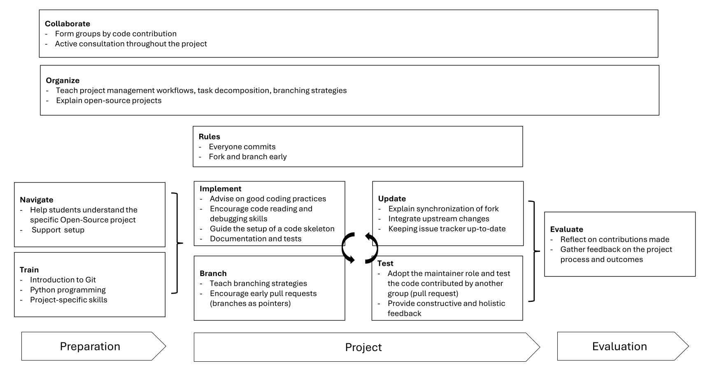

# Pedagogical concept

## Philosophy

The educational philosophy guiding this project aligns with progressive and humanistic principles, particularly those outlined by Dewey, Rogers, and Maslow.
Dewey’s **progressivism** advocates for experiential, hands-on learning, which is central to understanding open-source workflows and version control systems like Git.
This approach mirrors the collaborative, real-world challenges that students encounter in open-source software projects, where teamwork and practical problem-solving are essential.
Through such tasks, students actively engage in a social learning process, fostering critical thinking and collaboration.

**Humanism** further informs the project by emphasizing student-centered learning and individual agency.
In this project’s structure, learners have the autonomy to choose their sub-projects within the CoLRev framework.
With the instructor serving as a facilitator, students are encouraged to reach their potential in a supportive environment.
This framework prioritizes intrinsic motivation and self-directed learning, resonating with humanistic ideals of self-actualization and fostering a positive self-concept as students grow more confident in their software development abilities.

The course’s structure—a combination of block sessions, group work, and collaborative hacking sessions—is designed to support students through progressive stages of learning, from introductory overviews to focused project work.
By understanding Git, Python, and other core tools, students build the foundational skills needed to work within Git-based platforms like GitHub, mirroring industry practices in tech companies.
The project culminates in a final code review, where students’ contributions are integrated into the larger open-source project, emphasizing the value of their collaborative efforts and technical growth.
This hands-on experience enables students to not only gain practical skills but also develop a mindset oriented towards problem solving, continuous learning and community-driven improvement.

## Objectives

The teaching objectives are stated in the [syllabus/learning objectives](syllabus.html#goal-and-learning-objectives).

## Approach

The teaching approach is summarized in [syllabus/teaching approach](syllabus.html#teaching-approach).

## Implementation

{: .info }
> **TODO**: how/where to link these items in the teaching notes?

{: .info }
> **TODO**: Link details in GitCollaboration

<!-- 
Own publications

- GitCollaboration, TeaPad
 -->

## Materials

    
Hogbin Westby, E. J. (2015). Git for teams: a user-centered approach to creating efficient workflows in Git. O'Reilly Media.

    
Luciano, R. (2015). Fluent Python: Clear, Concise, and Effective Programming. O'Reilly Media.

    
Wagner, G., and Thurner, L. "Rethinking How We Teach Git: Recommendations and Practical Strategies for the Information Systems Curriculum". <i>Journal of Information Systems Education</i>, 36(1).

