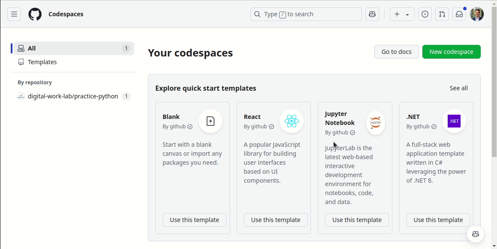
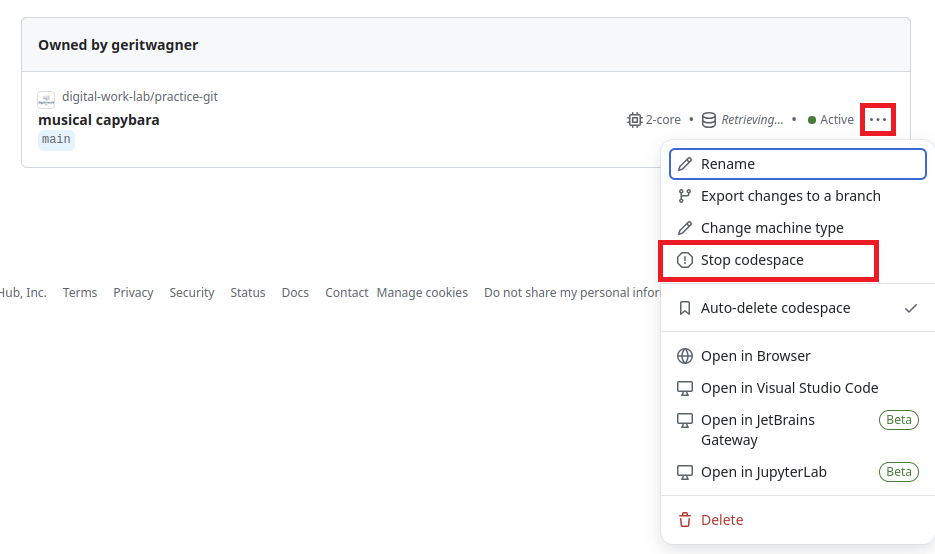

# Codespaces

-blue)

We    your <a href="https://github.com/digital-work-lab/open-source-project/issues/new/choose" target="_blank">feedback</a> and <a href="https://github.com/digital-work-lab/open-source-project/edit/main/docs/week_1_codespaces.md" target="_blank">suggestions</a> on this notebook!

---

With this notebook, we briefly explain how to work with GitHub Codespaces.

| Part | Label                                 |
|------|---------------------------------------|
|  1   | [GitHub account](#account)            |
|  2   | [Start](#start)                       |
|  3   | [Stop](#stop)                         |
|  4   | [Delete](#delete)                     |

---

## GitHub account 

For the tutorials and the project, you will need a GitHub account (you may also consider applying for [GitHub's Student Developer Pack](https://docs.github.com/en/education/explore-the-benefits-of-teaching-and-learning-with-github-education/github-education-for-students/apply-to-github-education-as-a-student){: target="_blank"})

## Start a Codespace 

A Codespace can be started directly from the GitHub repository (even a selected branch):

## Stop a Codespace 

You can **stop** a Codespace to stop consuming computational resources but **keep the data** via the [Codespaces overview](https://github.com/codespaces){: target="_blank"}:

## Delete a Codespace 

You can **delete** a Codespace to stop consuming computational resources and **remove all data** via the [Codespaces overview](https://github.com/codespaces){: target="_blank"}:

