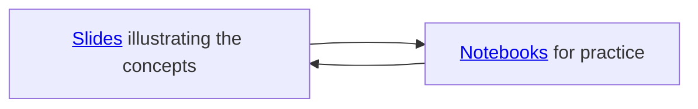

# Week 2: Introduction to Git

Learning Git, especially branching, committing, and collaborating, is essential for effective group work when contributing to the CoLRev Python package. Git enables multiple contributors to work on different parts of the project simultaneously through branching, allowing for experimentation without affecting the main codebase. By committing regularly, team members maintain a history of their changes, making it easier to track progress and revert mistakes. Collaboration features, like pull requests and merging, streamline the process of integrating code from different contributors while minimizing conflicts. Mastering these Git skills ensures smooth, organized teamwork and enhances the quality of contributions to the CoLRev package.

{: .objective }
In this session, our goal is to understand how to use Git to develop software in teams by covering the areas of branching, committing, and collaborating.

In the session, we will start with the concepts and iterate between the slides and the Jupyter notebooks.

{: .text-center}

In this session, we have covered the fundamentals of Git, including branching, committing, and collaborating, which are essential for effective teamwork in projects like the CoLRev Python package. Next week, we will dive into learning Python, where you will apply the Git commands you learned today to manage your Python scripts. Be prepared to commit different changes in your scripts, ensuring you can track and manage your progress using Git's powerful version control features.

{: .deliverable }
 To prepare for the next sessions, please set up your programming environment (see [instructions](https://colrev-environment.github.io/colrev/dev_docs/setup.html){: target="_blank"} in the CoLRev documentation)  ([deadline](../index.html#deliverables)).

## Materials

| Session      | Slides                                                                                                                        | Notebook |
|--------------|-------------------------------------------------------------------------------------------------------------------------------|----------|
| Git session  | {: target="_blank"} | {: target="_blank"} |

{: .see_also }
> - An explanation of [Internal Git Objects](https://git-scm.com/book/en/v2/Git-Internals-Git-Objects){: target="_blank"}

## Pedagogical Foundations

The foundations for the Git session are based on our recent paper (Wagner and Thurner 2025), which is peer-reviewed, based on pedagogical theory, and publicly accessible (see [link](https://digital-work-lab.github.io/rethink-git-teaching/){: target="_blank"}).

    
Wagner, G., and Thurner, L. "Rethinking How We Teach Git: Recommendations and Practical Strategies for the Information Systems Curriculum". <i>Journal of Information Systems Education</i>, 36(1).

