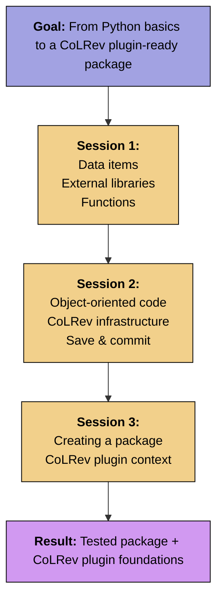

# Week 3: Introduction to Python

-blue)

In the two Python sessions, we will start to program in Python and explore the CoLRev Python package.
You do not have to bring prior experience with Python, but we assume that you are familiar with an object-orient programming language (like Java or C).

In the Python sessions, you might find the material either very straightforward or in need of more explanation and examples for practice.
We have prepared for both scenarios: for those who finish early, there are optional 'Challenge' tasks included in the notebooks.
These aren't mandatory but can help you start thinking about your upcoming project work.
If you have any questions during or after the sessions, we're here to assist. We've also provided additional resources for further practice.

{: .objective }
> In the two sessions, our goals are to
> 
> - Familiarize with the Python syntax
> - Understand how to use other Python modules and libraries
> - Prepare for extending the functionality of the CoLRev package

## Session 1

 

<iframe src="../output/03-python_1.html" 
        style="width: 100%; aspect-ratio: 16 / 9; border: 1px solid #ccc; border-radius: 5px;" 
        allowfullscreen>
</iframe>

 

| **Materials**       | **Link**                                                                                                  |
|----------------------|---------------------------------------------------------------------------------------------------------|
| Slides session 1     | {: target="_blank"} {: target="_blank"} |
| Notebook session 1   |  |

 

---

## Session 2

 

<iframe src="../output/04-python_2.html" 
        style="width: 100%; aspect-ratio: 16 / 9; border: 1px solid #ccc; border-radius: 5px;" 
        allowfullscreen>
</iframe>

 

| **Materials**       | **Link**                                                                                                  |
|----------------------|---------------------------------------------------------------------------------------------------------|
| Python session 2     | {: target="_blank"} {: target="_blank"} |
| Notebook session 2   |  |

<!-- 
 {: target="_blank"}
 {: target="_blank"}
-->

 

---

## Session 3: Creating a Python Package

 

<iframe src="../output/05-python_3.html" 
        style="width: 100%; aspect-ratio: 16 / 9; border: 1px solid #ccc; border-radius: 5px;" 
        allowfullscreen>
</iframe>

 

| **Materials**       | **Link**                                                                                                  |
|----------------------|---------------------------------------------------------------------------------------------------------|
| Python session 3     | {: target="_blank"} {: target="_blank"} |
| Notebook session 3   |  |

After you have used CoLRev in the last notebook, it is instructive to create a project and run through the operations to understand how CoLRev works.
To do this, we recommend starting a Codespace from the fork of your group.
You will also need to create a separate project directory in the Codespace (as explained in the notebooks).
Try to run the operations presented in the [asciinema recording](https://colrev-environment.github.io/colrev/){: target="_blank"} in the CoLRev documentation and analyze how the data in the project (Git) repository changes.

{: .deliverable }
Contribute code to a fork, create branches and merge code ([deadline](../index.html#deliverables)).