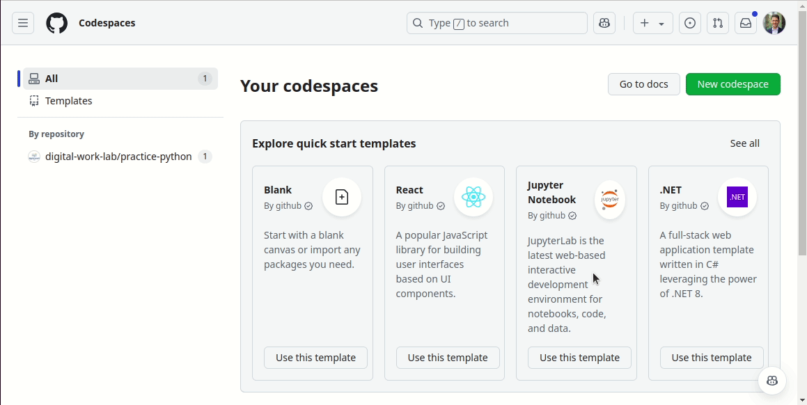

# Exercise notebook: Python 1

-blue)


We    your <a href="https://github.com/digital-work-lab/open-source-project/issues/new/choose" target="_blank">feedback</a> and <a href="https://github.com/digital-work-lab/open-source-project/edit/main/docs/week_3_python_notebook_1.md" target="_blank">suggestions</a> on this notebook!

---

With this notebook, you can familiarize yourself with Python syntax, create and run a Python package command, create and modify a dictionary data structure, and use an external library to read BibTeX records as dictionaries.

| Part       | Label                              | Time (min) |
|------------|------------------------------------|------------|
|  Part I    | [Setup](#setup)                    |     25     |
|  Part II   | [Data items](#data)                |     30     |
|  Part III  | [External libraries](#libraries)   |     30     |
|  Part IV   | [Functions](#functions)            |     60     |
|            | [Wrap-up](#wrap-up)                |      2     |
|            | Overall                            |    174     |

<br>


## Part I: Setup <a id="setup"></a>

**"How do I write and use Python code?"**

### Switch branch

Navigate to the [CoLRev repository](https://github.com/CoLRev-Environment/colrev){: target="_blank"}, select the `tutorial_python` branch and start Codespaces.

As a first step, we install the package dependency manager **Poetry**, which will be used in [part 3](#libraries):

```
pip install poetry
```

Next, we reset the state of the repository to the beginning of the tutorial:

```python
git reset --hard c9c915792f920e7198fed463ef7199cc84bb2264
```

- As the session progresses, you can checkout the current commits
- Whenever you see a `git reset --hard ...` command on the following slides, you can use it to set your repository to the required state (commit).

### Setting up entrypoints

We implement a simple version of CoLRev that should be available through a separate command:

```python
colrev run
```

{: .info }
> The previous command will initially create a `ModuleNotFoundError`. We will create this module in the next step.

**Tasks:**

- Check the last commit and the changes that were introduced. Which function does our new `run` command call?
-  Create the `run.py` module (module: file containing Python code) and the function that should be called. The function should print `Start simple colrev run`. Note that calling `colrev.ops.run.main()` means that colrev will try to import and run the `main()` function in the `/workspaces/colrev/colrev/ops/run.py` module.
- Check the other functions in the module `/workspaces/colrev/colrev/ui_cli/cli.py`, and other modules in the `/workspaces/colrev/colrev` directory if necessary.

## Part II: Data items <a id="data"></a>

**"How do I create and modify data items?"**

###  Data types

In this part, we focus on the data structure of dictionaries, which are often used in CoLRev. Dictionaries are efficient data structures, which can be used to handle bibliographic records, such as the following (in BibTeX format):

```Tex
@article{Pare2023,
  title   = {On writing literature reviews},
  author  = {Pare, Guy},
  journal = {MIS Quarterly},
  year    = {2023}
}
```

**Task**: Create a dictionary containing these data fields and print it when `colrev run` is called.

You can find the syntax for Python dictionaries (and many other data types) in the [W3School](https://www.w3schools.com/python/python_dictionaries.asp){: target="_blank"}.

**Challenge (optional)**: If you have completed the previous tasks, try to use the CoLRev constants for fields like `title`, `author`, etc.. In many cases, using constants like these is preferable to so-called "magic strings".

### Changing data

Next, we need a field indicating the record's status throughout the [process](https://colrev-environment.github.io/colrev/manual/operations.html){: target="_blank"}.

Add a `colrev_status` field to the dictionary, and set its value to `md_imported`. Create a commit once the command prints the following:


```python
Start simple colrev run
{'ID': 'Pare2023', 'title': 'On writing literature reviews', 'journal': 'MIS Quarterly', 'year': '2023', 'author': 'Pare, Guy', 'colrev_status': 'md_imported'}
```

To checkout the **solution**, run:

```python
git reset --hard 98a0db7aac2ba174989362594532b2128f4167fc
```

## Part III: External libraries <a id="libraries"></a>

**"How do I use external libraries?"**

### Finding and adding external libraries

Next, we decide to load (parse) a BibTeX file stored in the project. Search for an appropriate Python library to parse BibTeX files. Try to figure out how to install it and how to use it.

We decide to use the [BibtexParser](https://github.com/sciunto-org/python-bibtexparser){: target="_blank"} package, which is developed actively and available under an Open-Source license.

```python
pip install bibtexparser
```

To add it as a dependency of CoLRev and make it available for users of the CoLRev package, we run


```python
poetry add bibtexparser
```

<b>Task</b>: Check the changes and create a commit.

To checkout the **solution**, run:


```python
git reset --hard 859b02536acd0173cc4263a5e97a602826d8051f
cd /workspaces/colrev
pip install -e .[dev]
```

### Using external libraries

Go to the [bibtexparser tutorial](https://bibtexparser.readthedocs.io/){: target="_blank"} and figure out how to load a BibTeX file. An example `records.bib` file is available [here](../assets/records.bib). To use the file in your codespace, it needs to be uploaded. You can simply drag and drop the `records.bib` into `/workspaces/colrev`.

{: .info }
> Bibtexparser has a pre-release (version 2), but for this session, we use version 1 of bibtexparser.

Instead of defining the dictionary in the `run.py`, use the bibtexparser to load the `records.bib` file. Remember to store the `records.bib` in the **project directory**.

Afterward, loop over the records (`for ...`) and print the title of each record.

### Code quality

Create a commit, and observe how the code quality checks are triggered ([pre-commit hooks](https://pre-commit.com/){: target="_blank"}). Remember that you have to create the commit in the colrev repository. If there are any code quality problems, these checks will fail and prevent the commit. Try to resolve linting errors (if any). We will address the [typing](https://realpython.com/python-type-checking/){: target="_blank"}-related issues together.

To checkout the **solution**, run:

```python
git reset --hard f07be92d3c51ab8421caf57b77895dcb35395709
```

## Part IV: Functions <a id="functions"></a>

Next, we would like to create a function, which adds the `journal_impact_factor` based on the following table:

| journal                  | journal_impact_factor |
| ------------------------ | ----------------------|
| MIS Quarterly            |                    8.3|
| Information & Management |                  10.3 |

Add your changes to the staging area, run the pre-commit hooks, and address the warnings:

```python
pre-commit run --all
```

To checkout the **solution**, run:


```python
git reset --hard 0487d824ede2d36c4c011bfe46869d2aa9ed016b
```

---

## Wrap-up <a id="wrap-up"></a>

🎉🎈 You have completed the Python commit notebook - good work! 🎈🎉

In this notebook, we have learned to

- Write and execute Python code in Python packages and modules
- Create and modify data items, such as dictionaries
- Install and use external libraries
- Write modular code by using functions

To continue using your work in the next session, <b>stop</b> your Codespace [here](https://github.com/codespaces){: target="_blank"}.
In contrast to deleting a Codespace (which removes all files, changes, settings, etc.), stopping the Codespace preserves the current state of your work and does not consume computational resources.


