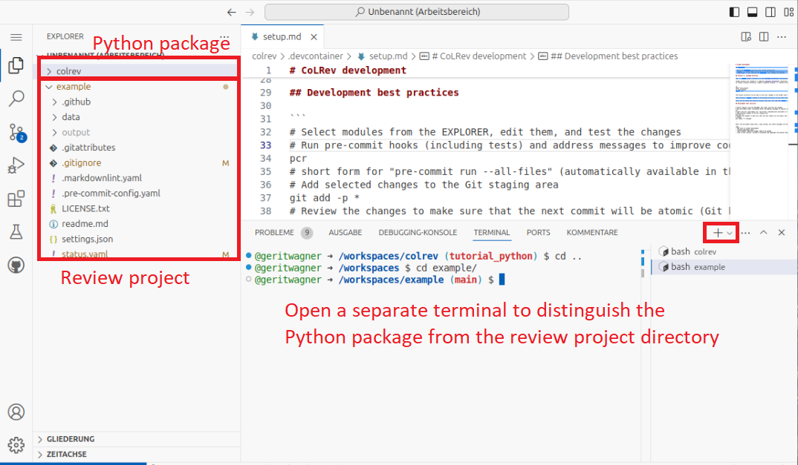

# Exercise notebook: Python 2

[-blue)](https://digital-work-lab.github.io/open-source-project/)


We    your <a href="https://github.com/digital-work-lab/open-source-project/issues/new/choose" target="_blank">feedback</a> and <a href="https://github.com/digital-work-lab/open-source-project/edit/main/docs/week_3_python_notebook_2.md" target="_blank">suggestions</a> on this notebook!

---

With this notebook, you can refactor to object-oriented code, switch to a real CoLRev project and load the records using the CoLRev classes, and save changes to create a commit.


| Part | Label                                   | Time (min) |
|------|-----------------------------------------|------------|
|      | [Set up the example repository](#setup) |     10     |
|  4   | [Object-oriented code](#object)         |     30     |
|  5   | [Programmatic use of CoLRev](#colrev)   |     20     |
|  6   | [Save and commit changes](#save-commit) |     20     |
|      | [Wrap-up](#wrap-up)                     |     10     |
|      | Overall                                 |     90     |

<br>


<br>

To continue working on your [Codespace](https://github.com/codespaces){: target="_blank"}, resume it as follows:


To checkout the **starting point** (commit), run:

```python
git reset --hard 0487d824ede2d36c4c011bfe46869d2aa9ed016b
```

### Set up the `example` repository <a id="setup"></a>

To use the typical CoLRev environments (objects), we clone an existing CoLRev project:

```python
cd /workspaces
git clone https://github.com/CoLRev-Environment/example.git
code -a /workspaces/example
```

The project directory `example` should now be displayed. Let's navigate to the directory and check the status:


```python
cd /workspaces/example
colrev status
```

**Task**: Briefly check the last commits of the project.

{: .info }
> **Important**
> 
> It is important to modify the code in the Python package directory and run all project-specific commands (`colrev ...`) in the project directory (in this case, `example`):
> 
> 

## Part 4. Object-oriented code <a id="object"></a>

**"How do I write object-oriented code?"**

### Object-oriented programming

Our next goal is to implement the previous example (adding the journal impact factor to the records) using Python objects/methods, and using the CoLRev infrastructure.

**Task**: Create the `JIFLabeler` class, instantiate an object, and add the `add_jif()` method (based on the [Python objects/methods syntax](https://www.w3schools.com/python/python_classes.asp){: target="_blank"}). Run and revise the code (if necessary).

**Hint** Also adapt the path of the records to `data/records.bib`. This is where CoLRev projects store the main records file.

To checkout the **solution**, run:


```python
git reset --hard 4590842765078886554108360b3c3c685ac8b24a
```

## Part 5: Programmatic use of CoLRev <a id="colrev"></a>

**"How do I use CoLRev infrastructure?"**

### Using CoLRev infrastructure

To use the CoLRev infrastructure, take a look at the [API reference](https://colrev-environment.github.io/colrev/dev_docs/api.html){: target="_blank"} and find the classes and methods that can be used to load and save records.

**Task**: Rewrite the code in `run.py` to use CoLRev classes and methods. Upon instantiating the `JIFLabeler`, instantiate a `ReviewManager` object and keep it as an object variable. When calling the `main` method, the records should be loaded by using the `ReviewManager`'s dataset methods.

**Hint**: Remember to import the required modules. Test your code, run the linters, and try to address potential warnings.

To checkout the **solution**, run:

```python
git reset --hard 8c9c2b1d26ed5d9e079d5a46c349d73032970075
```

## Optional challenge

To improve the code, try to implement these two changes:

- Instead of `print()` statement, it is recommended to use the `ReviewManager`'s logger.
- Instead of using the record dicts, it is recommended to work with the `Record` class and its `update_field()` method.

To checkout the **solution**, run:

```python
git reset --hard 2d9adbf3fa803e8122ee1b2e92fa8e8b1a9b2516
```

## Part 6: Save and commit <a id="save-commit"></a>

**"How do I save and commit changes?"**

### Save and commit changes

**Task**: Save the records (using the `dataset` attribute of `ReviewManager`) and create a commit (using the `ReviewManager`).

Review the commit and its content.

To checkout the **solution**, run:

```python
git reset --hard b3ae06d564773f9db6611deeb3ee0507ea54d6b0
```

---

## Wrap-up <a id="wrap-up"></a>

🎉🎈 You have completed the Python commit notebook - good work! 🎈🎉

In this notebook, we have learned to

- Write object-oriented code in Python
- Use CoLRev programmatically
- Save and commit changes in a CoLRev project
- Use stop and resume in GitHub Codespaces

Remember to delete your [codespace](https://github.com/codespaces){: target="_blank"} after the session.
