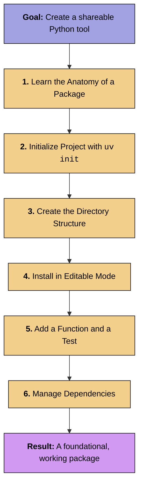

# Exercise notebook: Python 3 (packages)

-blue)




## 1. Introduction: What is a Python package?

A Python **package** is a standardized way to bundle and distribute reusable code so that others (or your future self) can easily install and use it with a simple `pip install ...` command.

In this module, you will learn the fundamentals by building a complete, working package from scratch. Our goal is to demystify the process and understand the **why** behind each step. We will build a simple but practical utility package that standardizes journal names in bibliographic data, which is a core task in literature review tools like `colrev`. In the last part, we will learn how to make the new package available as a plugin to `colrev`.

## 1b. Prerequisites: Setting up your tools

Before we begin, we need to ensure you have the necessary command-line tools. These do not come with Python and must be installed separately.

### Installing `uv`

`uv` is a modern, extremely fast tool for managing Python packages and projects. We will use it to initialize our project and handle dependencies.

Open your terminal or command prompt and run the following command:

```bash
# For macOS, Linux, and Windows WSL
curl -LsSf https://astral.sh/uv/install.sh | sh

# For Windows (Powershell)
irm https://astral.sh/uv/install.ps1 | iex
```
After installation, close and reopen your terminal. Verify it was installed correctly by running:

```bash
uv --version
```

You should see the installed version number printed.

### Installing `pytest`

`pytest` is the framework we will use to write and run tests for our code. While we could install it globally like `uv`, it's a best practice to install testing tools as **development dependencies** for each project. We will do this in Step 3.5.

## 2. The anatomy of a modern Python package

A consistent structure is key. It allows automated tools and other developers to understand your project instantly.

```
colrev-journal-formatter/
├── src/
│   └── colrev_journal_formatter/
│       ├── __init__.py
│       └── main.py
├── tests/
│   └── test_main.py
├── LICENSE
├── README.md
└── pyproject.toml
```

*   `pyproject.toml`: The **control center**. It contains the package name, version, dependencies, and build instructions.
*   `src/colrev_journal_formatter/`: The **source folder**. Your actual Python code lives here. Using `src` is a modern best practice that prevents many common import errors.
*   `tests/`: The **testing folder**. Contains code that automatically checks if your source code works correctly.
*   `README.md` & `LICENSE`: Your project's documentation and legal rules.

## 3. Step-by-step guide to creating your package

Let's build a package named `colrev-journal-formatter`.

### Step 3.1: Initialize the project with `uv`

First, create a directory and initialize the project.

```bash
mkdir colrev-journal-formatter
cd colrev-journal-formatter
uv init
```

This creates your `pyproject.toml` file. Let's examine every line:

```toml
[project]
name = "colrev-journal-formatter"
version = "0.1.0"
description = "A short description of the project."
authors = [ { name = "Your Name", email = "you@example.com" } ]
requires-python = ">=3.8"
dependencies = []

[build-system]
requires = ["hatchling"]
build-backend = "hatchling.build"
```

*   **`[project]`**: A standard section holding all your project's metadata.
*   **`name`**: The name used to install your package (`pip install colrev-journal-formatter`).
*   **`version`**: The current version. You should increment this with each new release.
*   **`dependencies = []`**: A list of other packages that your package needs to function. `uv add` will populate this list for you.
*   **`[build-system]`**: This section tells `pip` *how* to build your package. It specifies the "build backend" (`hatchling`) which acts as a "factory" to assemble your code into a distributable format.

### Step 3.2: Create the directory structure

Now, let's create the necessary files and folders for our code.

```bash
mkdir -p src/colrev_journal_formatter tests
touch src/colrev_journal_formatter/__init__.py
touch src/colrev_journal_formatter/formatter.py
touch tests/test_formatter.py
```

Note that Python package names often use underscores (`_`) instead of hyphens (`-`).

### Step 3.3: Install the package in editable mode

Install your package locally so you can use and test it as you develop. **Run this from the project's root directory.**

```bash
pip install -e .
```

The `-e` or `--editable` flag is essential for development. It creates a link to your source code instead of copying it. This means any changes you make to your Python files are immediately usable without needing to reinstall.

### Step 3.4: Add your core logic

Let's add our core logic. Open `src/colrev_journal_formatter/formatter.py` and add this code:

```python
# src/colrev_journal_formatter/formatter.py

def standardize_journal_name(name: str) -> str:
    """
    Standardizes a journal name by replacing common abbreviations.
    """
    abbreviations = {
        "J": "Journal",
        "Comput": "Computing",
        "Syst": "Systems",
        "Sci": "Science",
    }
    
    words = name.split()
    standardized_words = [abbreviations.get(word, word) for word in words]
    
    return " ".join(standardized_words)
```

### Step 3.5: Add `pytest` and write your first test

Now we'll add `pytest` as a dependency.

```bash
uv add pytest
```

This command adds `pytest` to the `[project.dependencies]` section in your `pyproject.toml`, installing it as one of your dependencies.

Next, open `tests/test_formatter.py` and add your tests:

```python
# tests/test_formatter.py
from colrev_journal_formatter.formatter import standardize_journal_name

def test_standardize_journal_name():
    """Tests that abbreviations are correctly expanded."""
    input_name = "J of Comput Syst"
    expected_name = "Journal of Computing Systems"
    assert standardize_journal_name(input_name) == expected_name

def test_no_abbreviations():
    """Tests that a name with no abbreviations remains unchanged."""
    input_name = "Journal of Modern Science"
    assert standardize_journal_name(input_name) == input_name
```

Finally, run the tests:

```bash
pytest
```


### TODO: Code quality

Create a commit, and observe how the code quality checks are triggered ([pre-commit hooks](https://pre-commit.com/){: target="_blank"}). Remember that you have to create the commit in the colrev repository. If there are any code quality problems, these checks will fail and prevent the commit. Try to resolve linting errors (if any). We will address the [typing](https://realpython.com/python-type-checking/){: target="_blank"}-related issues together.


Add your changes to the staging area, run the pre-commit hooks, and address the warnings:

```python
pre-commit run --all
```


## 4. Applying your skills: The `colrev` plugin context

You have just built a complete, tested Python package. This is the exact skill set needed to create a `colrev` plugin. A `colrev` plugin is simply a standard Python package that is designed to interact with the `colrev` framework.

The `standardize_journal_name` function you wrote is a perfect example of a data cleaning operation that a `colrev` `prep` package might perform. To turn your package into a real plugin, you would add more `colrev`-specific code to register it and have it process bibliographic records. The core work of writing clean, testable functions and packaging them, is exactly what you have just learned.

```toml
[project]
name = "colrev-journal-formatter"
description = "Journal formatter plugin for CoLRev"

...

[tool.colrev]
colrev_doc_description = "Journal name formatter"
colrev_doc_link = "README.md"
search_types = []

[project.entry-points.colrev]
prep = "colrev_journal_formatter.formatter:JournalFormatterPrep"

[build-system]
...
```

{: .info }
> **Note**
> 
> To validate the package setup in the context of CoLRev, you can run `colrev package --check` in the package directory. Once your CoLRev plugin is completed and published, open an issue in the [colrev repository](https://github.com/CoLRev-Environment/colrev/issues){: target="_blank"} to have it listed in the [overview of packages](https://colrev-environment.github.io/colrev/manual/packages.html){: target="_blank"}.

## 5. Conclusion and further steps

Congratulations! You have successfully created, installed, and tested a complete Python package from scratch. You've learned the fundamental skills of a modern Python developer:

*   **Structuring a project** with `pyproject.toml` and a `src` layout.
*   **Initializing a project** with `uv init`.
*   **Developing efficiently** using an editable install (`pip install -e .`).
*   **Ensuring code quality** with automated tests using `pytest`.
*   **Managing dependencies** declaratively with `uv add`.

These are the universal building blocks of shareable and maintainable Python code.

### Further Steps

Your journey as a package developer is just beginning. The logical next steps in a package's lifecycle are:

*   **Documentation:** A good `README.md` is essential. For larger projects, tools like **Sphinx** or **MkDocs** can build a full documentation website from your code's docstrings. Clear documentation is what separates a good project from a great one.
*   **Publishing:** To share your package with the world, you can publish it to the **Python Package Index (PyPI)**. This makes it available to anyone via `pip install your-package-name`. This process is typically automated using GitHub Actions.
