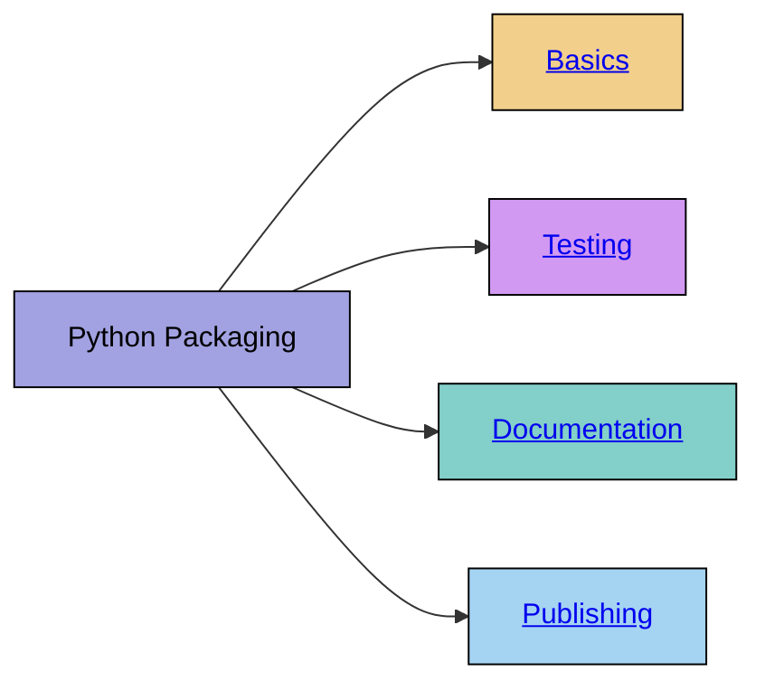

# Python packages

-blue)




## Basics

To create a Python package, it is essential to follow a clear structure that complies with best practices, such as those outlined in [PEP 517](https://peps.python.org/pep-0517/) and [PEP 518](https://peps.python.org/pep-0518/).
The structure ensures that the package is maintainable, pip-installable, and ready for distribution.
Below is an example of a typical package structure for CoLRev (Python) packages:

```
colrev-package
├── src
│   └── module.py
│   └── __init__.py
├── tests
│   └── __init__.py
├── LICENSE
├── README.md
└── poetry.lock
└── pyproject.toml
```

{: .blue }
> The `__init__.py` file marks a directory as a Python package, making its modules importable.
> It can also include initialization code for the package.
> For instance, it might define a package-wide variable or import frequently used modules to simplify access.

### Managing CoLRev Packages

To manage CoLRev packages, we use [Poetry](https://python-poetry.org/), a modern dependency and packaging tool.
Poetry simplifies the creation and management of Python projects by centralizing metadata and dependency specifications in a pyproject.toml file.

Below is an example pyproject.toml file for a CoLRev package:

```
[tool.poetry]
name = "colrev-package-name"  # Package name
version = "0.1.0"  # Initial version
description = "A short description of the package."
authors = [
    { name = "Author Name", email = "author@example.com" }
]
homepage = "https://example.com"
repository = "https://github.com/username/repo"
documentation = "https://example.com/docs"
bug-tracker = "https://github.com/username/repo/issues"
license = { file = "LICENSE" }
readme = "README.md"

[tool.poetry.dependencies]
python = ">=3.10, <3.13" # Python version
click = "^8.1.6" # Example dependency

[tool.poetry.scripts]
example-cli = "package.module:main_function"  # CLI entry point (example)

[build-system]
requires = ["poetry-core>=1.0.0", "cython<3.0"]
build-backend = "poetry.core.masonry.api"
```

{: .blue }
> The `tool.poetry.scripts` defines cli entrypoints. In this case, running `example-cli` in the shell would call the `main_function()` in the `package.module` module.

### Setting up the Package

Instead of the generic `poetry init` to create a new project, CoLRev provides a dedicated utility to streamline the process:

```
colrev package --init
```

This command sets up the essential files and folder structure tailored to CoLRev projects, ensuring compliance with the platform's standards.

### Installing a Package

Once the package structure is set up, it can be installed locally in editable mode using pip:

```
pip install -e .
```

This allows you to make changes to the package code and see the updates immediately without reinstalling.

### Using a Package

When using a package, it’s important to distinguish between the data directory and the package directory.
While "pure users" of the package may not know where the code resides, developers have installed it from a specific *package location* when running `pip install -e .`.

{: .blue }
> In GitHub Codespaces, it is necessary to create a separate data directory and open it in VisualStudio:
> 
> ```
> cd ..
> mkdir project
> code -a /workspaces/project
> ```

### Adding Dependencies

Adding dependencies to your project is straightforward with Poetry. For example, to add the `requests` library, use:

```
poetry add requests
```

Poetry ensures that all dependencies are properly versioned and recorded in the `pyproject.toml` file and the `poetry.lock` file.

### Checking the package

To check the setup of a CoLRev package, run

```
colrev package --check
```

## Testing

Initial testing of package modules is often done by running them directly as Python scripts.
This can be accomplished by including the following structure in your module:

```
# filename: module.py

# Code to test ...

if __name__ == "__main__":
    # Code to execute when the module is run directly
    print("This module is being run directly!")
```

To run the module as a Python script:

```
python module.py
```

This allows you to execute specific functions or test code when the module is called directly, but it will not execute if the module is imported elsewhere.

Once the functionality matures, it may be called through the CoLRev cli. For example, by running:

```
colrev search -a colrev.example_package
```

{: .blue }
> **Advanced testing strategy for ColRev**
> 
> Given that CoLRev packages create new commits in the data directory, it can be helpful to get the SHA of the initial commit and combine the tests with `git reset --hard COMMIT-SHA`.
> This ensures that your testing always starts from the same commit (the *COMMIT-SHA*).

Unit tests verify that individual components of your package function as expected.
Using pytest, you can write and run tests for your modules. Here’s an example of a test file structure:

```
# tests/test_module.py
def test_example_function():
    result = example_function()
    assert result == "expected result"
```

Run all tests using:

```
pytest test
```

This will execute all test cases in the `tests/` directory and provide a detailed report of the results.

## Documentation

Documentation is an essential part of any Python package.
It ensures that users can understand and effectively use your package while providing developers with a reference for maintaining or extending it.
Start with a clear and concise `README.md` file that outlines the purpose, features, installation instructions, and usage examples of your package. 

The documentation of individual CoLRev packages should be made available in the [overview](https://colrev-environment.github.io/colrev/manual/packages.html).
To accomplish this, CoLRev maintainers will run

```
colrev env --update_package_list
```

## Publishing

Making Python packages availbale on PyPI allows others to install the package using the simple command `pip install package_name`.
Publishing a Package to PyPI requires an account and authentication.
We recommend a publishing workflow based on GitHub actions, which are triggered every time a new release is published (see [publish_pypi.yml](https://github.com/CoLRev-Environment/colrev/blob/main/.github/workflows/publish_pypi.yml)).

{: .blue }
> Currenlty, built-in CoLRev packages are published and distributed with the CoLRev core package.
> In the future, they will be published as separate packages on PyPI.

<!-- https://hatch.pypa.io/latest/intro/#setup -->
