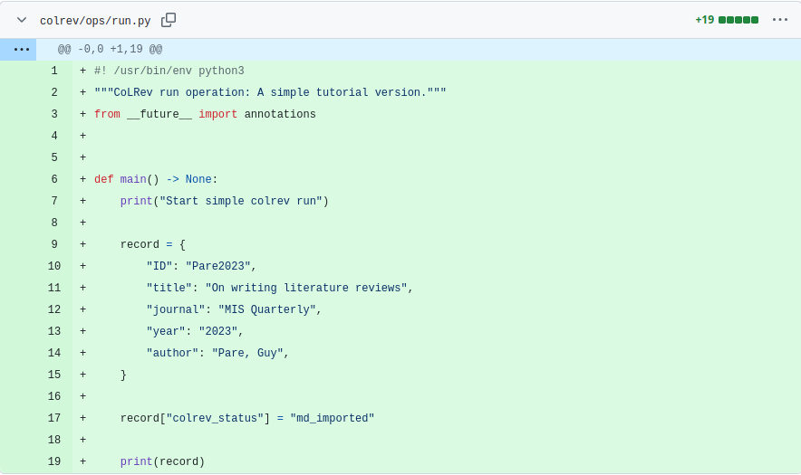
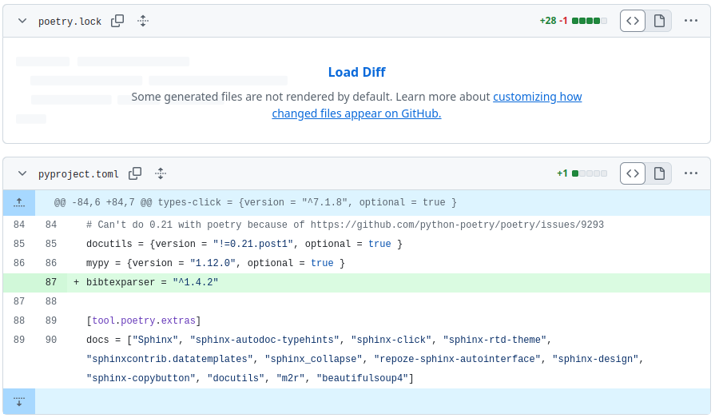
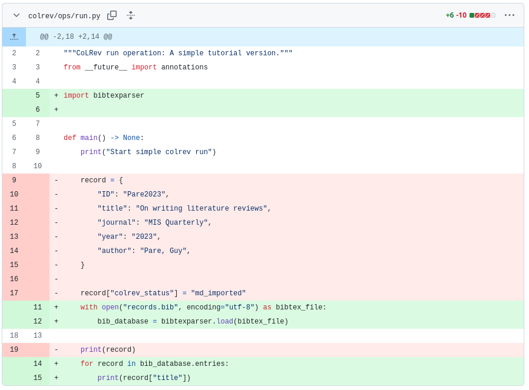
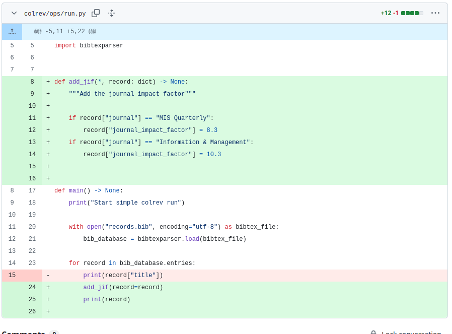

# Week 3: Python 1 (Teaching notes)

| Time (start)  | Duration  | Topic                             | Additional materials                                             |
|---------------|-----------|-----------------------------------|------------------------------------------------------------------|
| 00:00         | 10        | [Group formation](#groups)        |                                                                  |
| 00:10         | 20        | [Basic concepts](#python-basics)  |                                                                  |
| 00:30         | 10        | [Setup](#setup)                   | [notebook 1](week_3_python_notebook_1.html){: target="_blank"}   |
| 00:40         | 20        | [Data items](#data)               |                                                                  |
| 01:00         | 10        | Break                             |                                                                  |
| 01:10         | 30        | [External libraries](#libraries)  |                                                                  |
| 01:40         | 20        | [Functions](#functions)           |                                                                  |
| 02:10         | 10        | [Wrap-up](#wrap-up)               |                                                                  |

{: .objective }
> - Familiarize with Python syntax
> - Learn good debugging and development practices
> - Understand how to extend a Python package (CoLRev)

{: .info }
> - Have students start the codespaces on Github from colrev/tutorial branch (see notebook)
> - It is important that students work on Codespaces (not their own machines) to avoid technical setup issues

<div class="page-break"></div>

# Preparation

```
git checkout tutorial_python
git rebase -i HEAD~16
# edit the "update click" commit (before the tutorial starts) with the latest pyproject.toml / poetry update to update poetry.lock
git rebase main
git push -f
```

- [ ] Update git-commit SHAs in the notebooks
- [ ] Checkout tutorial2 branch (tutorial branch should be available as a backup)
- [ ] Test the tutorial in Codespaces

<!-- 
- before switching to tutorial/after the tutorial:
run pip3 install -e . (to take code from the right repository)
 -->

- [ ] Print the teaching notes, including code diffs (python-tutorial-notes.odt) for the commits on paper (to facilitate life-coding)

# Group formation <a id="groups"></a>

- Who forked/leads
- Clear announcement for overbooked groups

Highlight:

- Use google/Stackoverflow on any error/challenge that comes up!
- Using Code quality checkers and tests

Discuss take-home exercise (collaborating)?

<div class="page-break"></div>

# Python  <a id="python-basics"></a>

- Object-oriented
- Procedural
- Functional

Interpreted language: unlike Java which requires us to compile the jar file 

- Strongly typed: Explicit conversion required
- Python fails at runtime when asked to multiply/divide strings and strings. If you need the numbers stored inside a string variable, you need to cast it explicitly (`int_var = int("99")`).
- Dynamically typed: typing information is only evaluated when running code (e.g., string * string in if-statement that is not evaluated does not fail)

Example:

```
Java: 
int count = 2;

Python:
count = 2
# type(count) = class:int (everything is an object)
word = "test"
count*word = "testtest"
word+count # raises TypeError (searches for addition-operation for two strings and fails)
word+str(count) + "test2"
# think: count = "2"
if False:
  cound+word # not error - never executed (dynamically typed, i.e., only evaluated at runtime)
if True:
  cound+word # error
```

<!-- https://www.futurelearn.com/info/courses/python-in-hpc/0/steps/65121#:~:text=Python%20is%20both%20a%20strongly,is%20determined%20only%20during%20runtime. -->


Our focus: using the programming language to build things (not to understand the programming language)

{: .warning }
> It is important to run colrev in a separate data directory.

Setup for the data directory:

```
shell:
cd ..
mkdir data
Datei: Ordner zum Arbeitsbereich hinzufügen (select workspace/data)
open two separate shells
```

# Setup <a id="setup"></a>

- Explain `__main__`

- commit: pre-commit hooks!
- explain later (they do some formatting and warn us if there are code quality issues)

Goal: orientation/read code, try to figure out things

# Data items <a id="data-items"></a>

Optional additional challenge: use the constants as keys (package development docs)



<div class="page-break"></div>

# External libraries <a id="libraries"></a>

after 2-3 minutes: write BibtexParser on the blackboard

{: .warning }
> **Important: bibtexparser version has changed**
> 
> Students need to use the old entrypoint (available in the docs menu "Migrating: v1 -> v2").

```
# v1
import bibtexparser
with open('bibtex.bib') as bibtex_file:
    bib_database = bibtexparser.load(bibtex_file)
```





<!--
Note: our version (on tutorial_branch) only works with v1.
At some point, we may migrate to v2
> Or install the new version using
> 
> pip install --no-cache-dir --force-reinstall git+https://github.com/sciunto-org/python-bibtexparser@main
 -->

# Functions <a id="functions"></a>

Remember:

- Call-by-value: for "simple data types" (str, int, float)
- Call-by-reference: for mutable objects (list, dict, object)

```
# Starting point: add_journal_impact_factor(record: dict) changes the values of the dictionary outside the function (without an explicit return/assignment)

def change_journal(journal: str) -> None:
  journal = "Nature"

journal = "MIS Quarterly"
change_journal(journal)
print(journal) # prints MIS Quarterly (not nature) due to call-by-value for simple/immutable data types in Python
```

Show input() when iterating over the results

Google
- "mypy no-untyped-def"
- "mypy no-untyped-def"
- "pylint missing-function-docstring"

Explain difference between positional and keyword arguments

Note: it can be helpful to make mistakes on purpose (e.g., indentation, etc.) to read and interpret the error messages with students.

Pylint example.

```
example:
************* Module colrev.ops.built_in.search_sources.aisel
colrev/ops/built_in/search_sources/aisel.py:225:19: W3101: Missing timeout argument for method 'requests.get' can cause your program to hang indefinitely (missing-timeout)
```



<div class="page-break"></div>

# Wrap-up <a id="wrap-up"></a>

- Small examples: clarify the "big goal" and start with small steps
- Linters: already installed
- Code highlighting (visual studio): functions yellow, variables light blue, instances blue, classes green, strings orange
- Python debuggers/plugins (for regular Python programming / special cases like memory usage or distributed systems)

## Resources

- [Python programming for data science](https://www.tomasbeuzen.com/python-programming-for-data-science/README.html){: target="_blank"} with Python basics (and **unit tests**)
- [Welcome to Python Packages](https://py-pkgs.org/){: target="_blank"}
