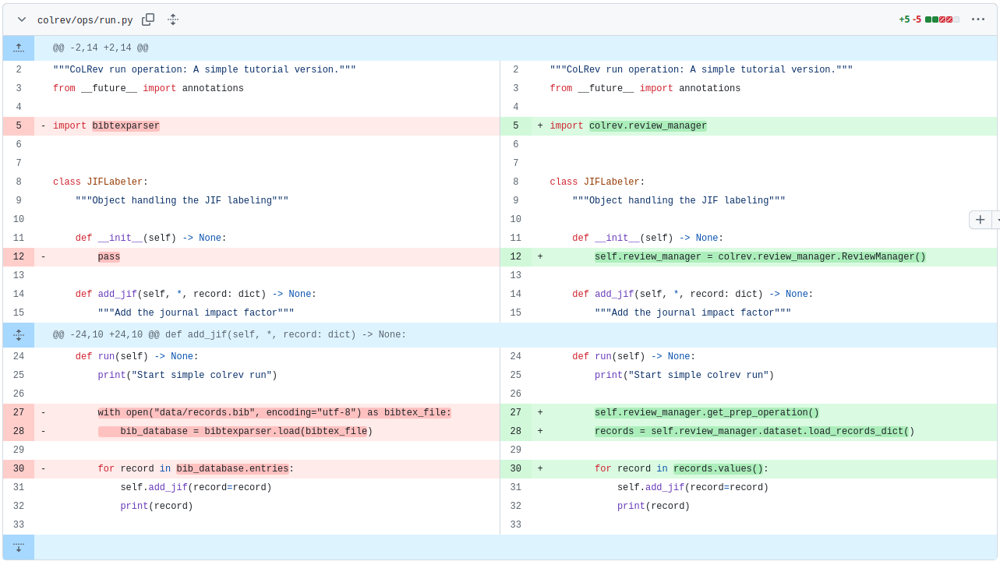
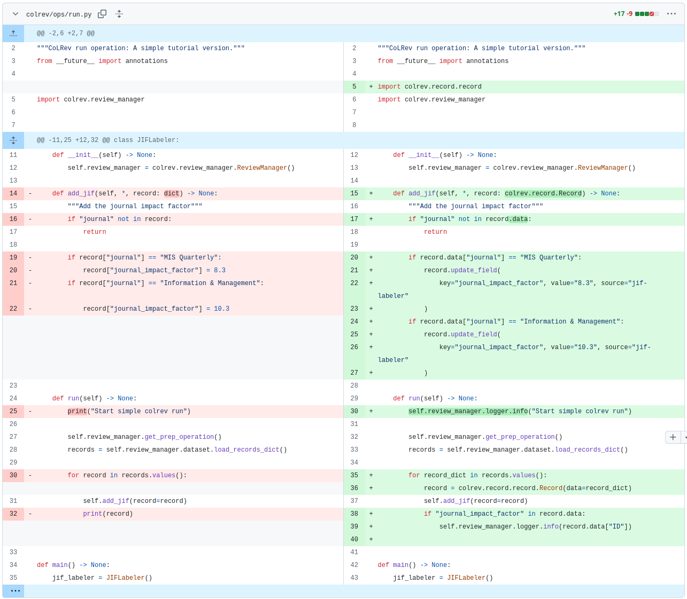
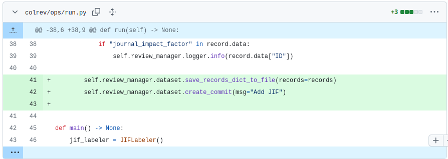

# Week 3: Python 2 (Teaching notes)

| Time (start) | Duration  | Topic                                           | Additional materials                                              |
|--------------|-----------|-------------------------------------------------|-------------------------------------------------------------------|
| 00:00        | 10 min    | Set up the example repository                   |                                                                   |
| 00:10        | 60 min    | Part 4: [Object-oriented code](#object)         | [notebook 2](week_3_python_notebook_2.html){: target="_blank"}    |
| 01:10        | 30 min    | Part 5: [Programmatic use of CoLRev](#colrev)   |                                                                   |
| 01:40        | 10 min    | Part 6: [Save and commit changes](#save-commit) |                                                                   |
| 01:50        | 10 min    | [Wrap-up](#wrap-up)                             |                                                                   |
| **02:00**    | **120 min** | **Overall**                                   |                                                                   |

{: .info }
> - Have students start the codespaces on Github from colrev/tutorial branch (see notebook)
> - Ask students how they interpret the error messages, articulate the problem, how they would solve the problem, where/how they would search (do not provide solutions)
> - Run the pre-commit hooks a few times to illustrate the typing information

<div class="page-break"></div>

{: .warning }
> It is important to run colrev in a separate data directory.
> 
> **Clearly demonstrate to students how to set both up in explorer and bash.**

Setup for the data directory (code: see [setup in notebook](week_3_python_notebook_2.html#set-up-the-example-repository))

```
# generally: in shell:
cd .. &&  mkdir data
code -a /workspace/data
# or: Datei: Ordner zum Arbeitsbereich hinzufügen (select workspace/data)
# open two separate shells
```

{: .info }
> Also show the history of the example colrev project.

## Object-oriented programming <a id="object"></a>

- Encourage students to program using objects (instead of procedurally)
- Show simple object syntax

```python
class Dog: # Define a class
    # Constructor method
    def __init__(self, name, age):
        self.name = name  # instance variable
        self.age = age

    def bark(self): # Instance method
        print(f"{self.name} says woof!")
    def birthday(self):
        self.age += 1
        print(f"{self.name} is now {self.age} years old!")

# Create objects (instances) of the class
dog1 = Dog("Buddy", 3)
dog2 = Dog("Luna", 5)
# Call methods on the objects
dog1.bark()        # Output: Buddy says woof!
dog2.birthday()    # Output: Luna is now 6 years old!
```

- Notice: when creating the `run()` method, the jif_labeler_instance switches to "self".


<div class="page-break"></div>

## Using CoLRev infrastructure <a id="colrev"></a>

- Go to API reference
- Navigate through the classes / dataset





## Save and commit  <a id="save-commit"></a>

- Ask students to analyze the changes that were actually committed
- Remind students that this is something they should have seen in the CoLRev tutorial.



<div class="page-break"></div>

## Merging Exercise (moved to a later time point)

**Until the 10th of November**

- explain to the students what the merging exercise is about 
- tell them about the survey and that it is important to fill it out for the best practice session
- maybe create even a slide for students to look it up again

## Wrap-up <a id="wrap-up"></a>

**Deliverables**

- The merge should be done in one of the first hacking session meetings
- Students should prepare the merge by selecting suitable branches and explaining why they should be merged
- We will complete the merge together with the students to prevent and solve problems

Note: "synchronizing with upstream" would be one example of a merge.

**Next: Best practice and hacking sessions (per group)**

- Suggest pair-programming
- Which CoLRev-objects or libraries will be needed, and which steps are required
- Create a fork for the team, give access to team members, and add a note to the issue feed
- Check the resources provided with the issue, discuss the project, and make plans

## Resources 

- [Python programming for data science](https://www.tomasbeuzen.com/python-programming-for-data-science/README.html){: target="_blank"} with Python basics (and **unit tests**)
- [Welcome to Python Packages](https://py-pkgs.org/){: target="_blank"}
