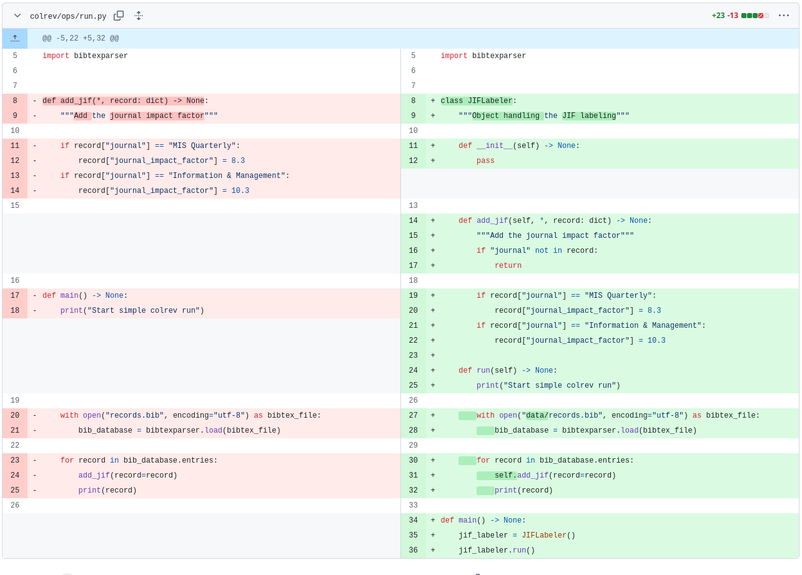

# Week 3: Python 2 (Teaching notes)

| Time (start) | Duration | Topic                                           | Additional materials                                              |
|--------------|----------|-------------------------------------------------|-------------------------------------------------------------------|
| 00:00        | 30       | Part 4: [Object-oriented code](#object)         | [notebook 2](week_3_python_notebook_2.html){: target="_blank"}    |
| 00:30        | 30       | Part 5: [Programmatic use of CoLRev](#colrev)   |                                                                   |
| 01:00        | 10       | Part 6: [Save and commit changes](#save-commit) |                                                                   |
| 01:10        | 2        | [Wrap-up](#wrap-up)                             |                                                                   |
| 01:12        | 72       | Overall                                         |                                                                   |

{: .info }
> Have students start the codespaces on Github from colrev/tutorial branch (see notebook)

# Python session 2

- Run the pre-commit hooks a few times to illustrate the typing information

## Object-oriented programming 

- Encourage studengs to program using objects (instead of procedurally)
- Notice: when creating the `run()` method, the jif_labeler_instance switches to "self".

## Using CoLRev infrastructure 

- Go to API reference
- Navigate through the classes / dataset

## Save and commit  

- Ask students to analyze the changes that were actually committed
- Remind students that this is something they should have seen in the CoLRev tutorial.

<!-- 

TBD:
  - search: run an api-search example, examine the commit message (settings changed! -> reference implementation)
-> we add a query -> docs: interface definitions: searchsource.add_endpoint(), run_search()
  -> see interfaces (standardized function parameters/names)
  - where to find the built_in reference implementation (docs/architecture and directories), how to add/remove in the settings
  -> see package_endpoint definitions (package_manager, docs)

  continue: prep/validation

  continue to data: show advice?
-->

## Wrap-up 

**Next: Best practice and hacking sessions (per group)**

Pair-programming

Which CoLRev-objects or libraries will be needed, which steps are required

- Create a fork for the team, give access to team members, and add a note to the issue feed
- All team members: clone the fork (using `git clone git@github.com:CoLRev-Environment/colrev.git`)
- Check the resources provided with the issue, discuss the project, and make plans

## Resources 

- [Python programming for data science](https://www.tomasbeuzen.com/python-programming-for-data-science/README.html){: target="_blank"} with Python basics (and **unit tests**)
- [Welcome to Python Packages](https://py-pkgs.org/){: target="_blank"}
