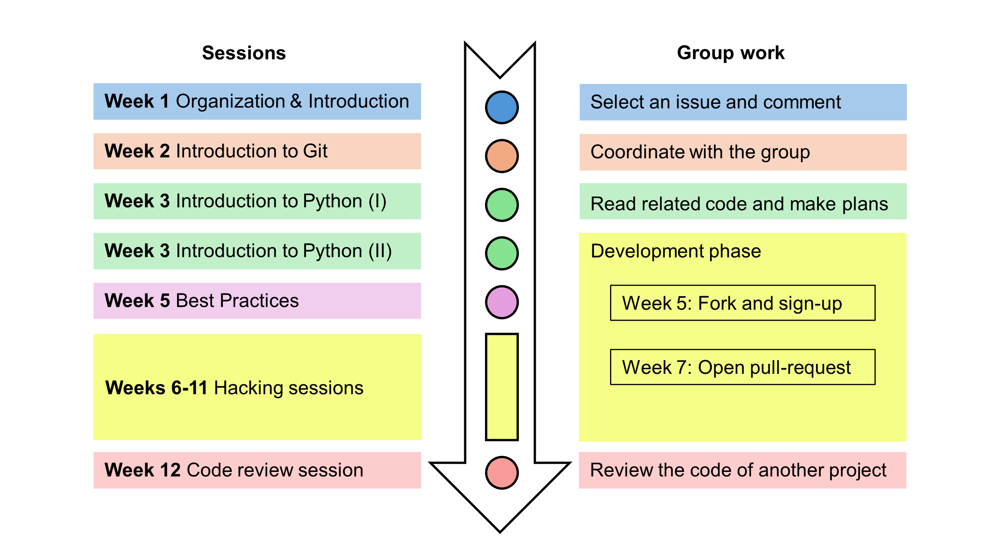

# The Open-Source Project

<!-- 
**TODO : Infos on topic and process (making an impact/contributing to an open source project)**

TODO : no registration required.

TODO : same title in all systems: WI-Project Open-Source Development??

-->

Welcome to the Open-Source Project! You can find all information about this project in our [syllabus](docs/syllabus.html). The outline for sessions and tasks is below:

<!--

 ## Course outline -->

### Week 1: October 14-18

| No. | Session | Date and Location | Slides |
|-----|---------|------------------|--------|
| 01  | Organization and topics | 16. October, 14.00-16.00 (WE5 01.003) | [Slides](output/01-topics.html){: target="_blank"} |

Tasks to complete in this week:

- Sign up for the [VC course room](https://vc.uni-bamberg.de/course/search.php?search=Digital-Work-Projekt-B) (passwords are distributed during the first session).
- Create a [GitHub account](https://github.com/signup){: target="_blank"}.
- To [find a group](https://digital-work-lab.github.io/open-source-project/output/01-topics.html#8){: target="_blank"}, read the open issues for the relevant milestone and contribute to the discussion (navigate to the [CoLRev project](https://github.com/CoLRev-Environment/colrev){: target="_blank"}, and the *Issues* / *Milestones* section).

{: .deliverable }
**Set up a Codespace for the Git and Python sessions (optional: local setup)**: May 10

### Week 2: October 21-25

| No. | Session | Date and Location | Slides |
|-----|---------|------------------|--------|
| 02  | Introduction to Git | 23. October, 14.00-18.00 (WE5 01.003) | [Slides](output/02-git.html){: target="_blank"} |

- Set up your programming environment (see [instructions](https://colrev-environment.github.io/colrev/dev_docs/setup.html){: target="_blank"} in the CoLRev documentation)

### Week 3: October 28 - November 1

| No. | Session | Date and Location | Slides |
|-----|---------|------------------|--------|
| 03  | Introduction to Python (I) | 28. Ocotber, 8.00-12.00 (WE5 1.003) | [Slides](output/03-python_1.html){: target="_blank"} |
| 04  | Introduction to Python (II) | 30. October, 14.00-18.00 (WE5 1.003) | [Slides](output/04-python_2.html){: target="_blank"} |

{: .deliverable }
**Contribute code to a fork, create branches and synchronize with upstream**: May 10

### Week 5: November 11-15

| No. | Session | Date and Location | Slides |
|-----|---------|------------------|--------|
| 05  | Best practices | 13. November, 14.00-16.00 (WE5 01.003) | [Slides](output/05-best_practice.html){: target="_blank"} |

### Weeks 6-11: November 18 - January 12

- Individual hacking sessions, upon [Appointment](https://calendly.com/gerit-wagner/30min){: target="_blank"} (WE5 1.081 or online)

{: .deliverable }
**Create the pull request**: December 20 (code is evaluated on December January 12)

### Week 12: January 13-17

| No. | Session | Date and Location | Slides |
|-----|---------|------------------|--------|
| 06  | Code review session | **TBA**, ISM Labor 1.094 |[Slides](output/06-presentations.html){: target="_blank"} |

### Week 13: January 20-24

{: .deliverable }
**Implement the feedback provided in the pull request**: January 24

Upon completion, we celebrate the accomplishments of our students in the [hall of fame](docs/hall_of_fame.html) and the official [list of contributors](https://github.com/CoLRev-Environment/colrev?tab=readme-ov-file#contributors){: target="_blank"} 🎉 🍾 🎈

<!-- 
You can read more about my work [here](docs/instructor.html).

slides
resources and links
instructor

TBD: include a picture?
TODO : make group fotos and publish

objectives: mention tools and open synthesis?
-->
