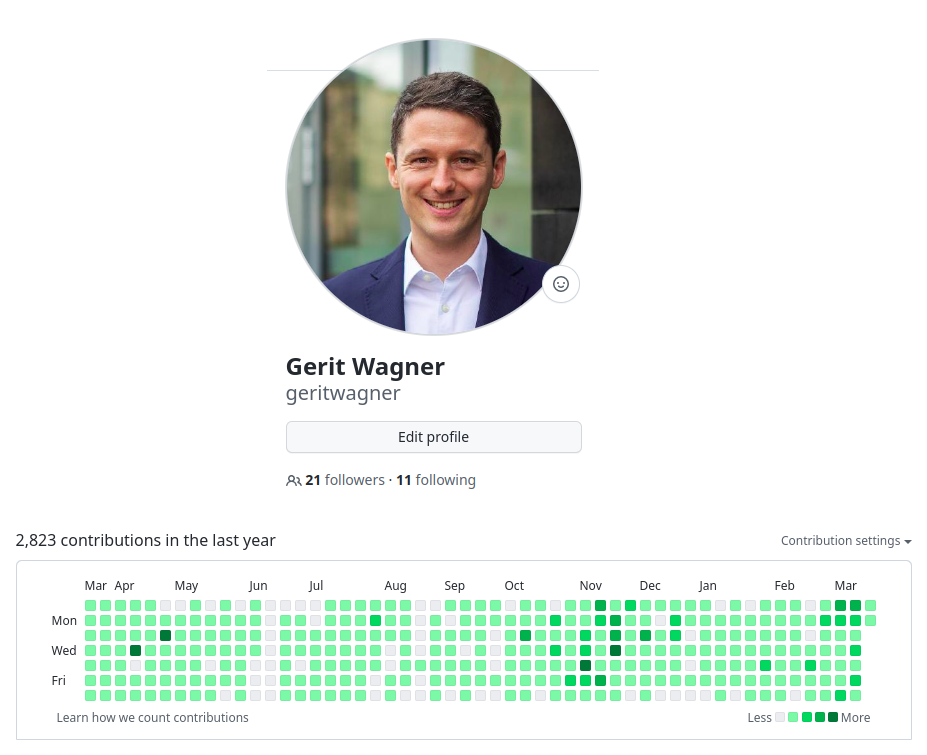

<!-- paginate: true -->

# WI-Project: Open-Source Project with Git and Python

Junioprofessur für Digital Work

<!--
Ask: WI/ISM?, Experience in programming, in git/python, open-source development?
-->

---

# Your instructor

- Prof. Dr. Gerit Wagner
- At Bamberg University since October, 2022
- Active coding in Git, Python, and R since 2014
- My latest and most significant project: CoLRev
- I enjoy coding, solving programming puzzles, and building tools that are useful for others

<!--
You wee when I took vacation
It takes 10 years to become good at something
Git/Python/R: for my research projects
Enjoyment/challenge/making an impact: that's what I want you to experience in this project.
-->

---

# Agenda

1. Organization and topics (**today**)
2. Introduction to git (April 25)
3. Introduction to Python (May 2)
4. Individual hacking sessions (May-June)
5. Pull request and presentation (July 10-14)

---

# What you will learn

- Use git/GitHub for versioning and collaboration
- Write code in Python
- Make a first contribution to an Open-Source project

<!-- 
Git und Pyhton kurz erkären/motivieren

Github platform: tests, continuous integration, forks, ...
-->

---

# Expectations

- Programming experience (courses: IIS-EBAS-B, DSG-EiAPS-B, AI-AuD-B, DSG-JaP-B)
- Learning Git and Python
- Embrace the challenge and adopt a problem solving mindset
- Take full responsibility to set up your programming environment
- Be prepared. Know your code, be able to explain it, and ask prepared questions (Google it, consider different options)
- Do not use generative AI such as ChatGPT (copyright infringement when publishing results as Open-Source code)

<!--
Klar kommunizieren: wenn ihr die Programmiererfahrung/Kurse nicht mitbringt und euch das nicht zutraut, dann belegt das Projekt eher im nächsten Semester.

Highlight: your contribution will be public/used by others!

Ggf. auf Projekt im nächsten Semester verweisen

Clear message:
- You have to learn git and python. I will provide an introductory session, but you will need to invest more time.
- you are expected to set up your environment. I am available to answer questions, but I cannot setup individual machines.

contribution: you are expected to make that contribution (know what you do, be able to explain it - you cannot use generative AI like ChatGPT because you will have to submit the code under the MIT license.)

small teams, everyone is expected to program and contribute - with git, we see contributions. - that's a good thing if you tend to pull your weight

-->

---

# How groups will form

You are not automatically assigned to a group. You assign yourself to a group when you contribute code following these steps:
- Step 1: **Signal your intent** to contribute by joining the issue discussion on Github (by April 24, for two topics at most).
- Step 2: **Organize your work**, meet potential group members, and select a project leader (in the following sessions). Keep in mind that no more than 5 people will be accepted per group.
- Step 3: **Officially sign up for a seminar group** by contributing a non-trivial code part. Contributions of team members must be in separate commits. Select a project lead who sends your Github-ID together with a link to your code contribution, your student ID, and e-mail address to [gerit.wagner@uni-bamberg.de](mailto:gerit.wagner@uni-bamberg.de). Your participation will be confirmed and your account will be linked to the project issue.

The group assignment based on actual code contribution is intended to ensure that **all group members make a fair contribution to the project**. It is at the instructors discretion to adapt the rules if necessary. It is your responsibility to bring up concerns early.

<!-- 
Sie haben es selbst in der Hand - Sie können sich bei dem Thema einbringen, das Sie interessiert!

the next sessions will also serve as a group forming session

projekt: gruppenfindung:

- Generell ansagen: ich mache keine Gruppen am Anfang. Man zeigt, dass man an einem Teiltehma mitarbeitet wernn man zu einem Pull-request beiträgt. Man kann anderen signalisieren, wenn man an einem Thema interessiert ist, indem man einem issue folgt. Man kann also auch strategisch issues wählen, denen keiner folgt. Es ist wichtig, früh zu pushen. Es ist möglich (und empfman ohlen) aber nicht zwingend notwendig, sich in Teams zu treffen.
-> Regel: wenn man auf einen issue pushed muss man sich ausreichend vorher eingetragen haben, im issue kommunizieren.
- Ich behalte mir vor, bis zur Python session (willkürlich bzw. in Abstimmung) Gruppen zu verkleinern (bestimmte TeilnehmerInnen zu verpflichten, in andere Themen zu wechseln).
- Eigene Verantwortung: Gruppen mit mehr als 5 Teilnehmenden sollten vermieden werden, müssten substantiell höhere Erwartungen erfüllen. Jeder TeilnehmerIn ist verpflichtet, mir zu signalisieren, wenn Gruppen zu groß werden.
-> Gruppen in den späteren Sessions bitten, sich zusammenzusetzen (austausch anstoßen)
-> Durchmischung kann durch "Überbuchen" von beliebten Issues getrieben werden (es wird zufällig/von mir ausgewählt, wer wechseln muss)
-> es bleibt in gewissem Umfang möglich, die Themenauswahl/Gruppenauswahl mit zu beeinflussen (zB. wenn man in kleinen Gruppen auf Themen mit wenig Interessenten geht)

-> Ich setze Anreize, dass Beiträge früh geleistet werden (keine Riesen-Commits kurz vor Schluss), und dass eine gute Abstimmung in der Gruppe erfolgt (Anforderungen), und dass die Gruppenverteilung ausgeglichen ist (nicht Open-Source konform, aber für das Projekt wichtig.)

-> Abstimmen mit den Füßen (Open-Source-like)

-> anders als DBs vorschlag (Durchmischung)

-> gut erklären, wie sich ein Open-Source Projekt organisiert (issues, transparente Kommunikation, ...)

DB: alle mitnehmen? LT: quote erforderlich? (WI/ISM)

ASK: how many ISM (Java not mandatory) and WI?
-> maybe require a certain number of ISM students per group?

-->

---

# The project: CoLRev

Collaborative Literature Reviews (CoLRev) is an open-source environment for collaborative literature reviews. It integrates with differerent synthesis tools, takes care of the data, and facilitates Git-based collaboration.

The following features stand out:

- An open and extensible environment based on shared data and process standards
- Builds on git and its transparent collaboration model for the entire literature review process
- Offers a self-explanatory, fault-tolerant, and configurable user workflow

<!-- 
Ambition: Open-source environment for literature reviews (like R for statistics, or Python for ML)

Wer hat schon mal eine Literaturübersicht geschrieben?

Command line!

git as an inspiration: rapid adoption (not because there were shiny interfaces, but because the data management was very efficient, reliable, and scalable to large teams)

-->
---

# Finding things in an Open Source project

Go to the [CoLRev project repository](https://github.com/CoLRev-Ecosystem/colrev).

Form groups of three and try to find the following information in 10 minutes:

1. How many commits, contributors, and downloads does the project have? What's the test test coverage?
2. Where is the documentation and how can I install CoLRev?
3. What's the license and where can we find information on how to contribute to the project?
4. What information should be provided for bug reports, where can I open a feature request?
5. How many issues are open vs. closed? How many pull requests are open vs. closed?
6. How long to workflows with tests or code formatting run, when did the last one fail?
7. What is "unpaywall" used for in the project?
8. Where can we find the features planned for milestone v0.10.0 (due August 1st)?

<!-- 
"Schnitzeljagd" - auf Zeit
-> bei der Programmierung wichtig: Bibliotheken schnell einschätzen.

Nach 5 minuten fragen: wer ist schon fertig? ggf. mehr Zeit geben.
TODO : auflösen!

Correcponds to Software selection (criteria) -> ask: what does each concept mean?

unpaywall: search the github project or documentation (rst: documentation, py: get_pdf method)

go to new issue -> show template for bugs/new features

Afterwards: Ask who has found (1, 2, ...)
- show solutions
- Note: what should be improved?

Show the colrev/github website, documentation, explain the git/open-source community structure

Show architecture graph

Show the issues/the good-first-issue (and the code-markers)

-> the topics (features of 0.10.0): what we will look at later.

-->

---

# CoLRev: Demo and Topics

An overview of the [process](https://colrev.readthedocs.io/en/latest/manual/operations.html) and the [worfklow](https://colrev.readthedocs.io/en/latest/manual/workflow.html) are available in the documentation.

The topics cover:

- [API-based information retrieval](https://github.com/CoLRev-Environment/colrev/issues/120)

- [Data modeling and preparation](https://github.com/CoLRev-Environment/colrev/issues/129)

- [Data structures and schema validation](https://github.com/CoLRev-Environment/colrev/issues/107)

- [Data validation based on domain-specific rules](https://github.com/CoLRev-Environment/colrev/issues/109)

- [Analytics dashboards](https://github.com/CoLRev-Environment/colrev/issues/130)

A brief overview is available on [YouTube](https://www.youtube.com/watch?v=yfGGraQC6vs).

<!-- 

Show that each issue has specific pointers to the code, mention that I am available to answer questions, provide feedback in the hacking sessions

Demonstrate workflow

- search: SearchSource: API-example: resembling Topic 1
- prep: This is where the journals (Topic 2) would provide input
- validation: show example -> validate also applies to review types (show problem formulation in the docs). (Topic 3)
- colrev stauts -> dashboard of the sample, burn-down chart (Topic 4)
- data: Data extraction (structured) -> validation, illustrate errors Topic 5

-->

---

# Find a topic

- Go to [milestone v0.10.0](https://github.com/CoLRev-Ecosystem/colrev/milestone/5) and read the open issues (available topics).
- Find others who are interested in the same topic.
- Ask questions.

<!--
Ask: who is interested in topic 1, ...?
-> connect people

Are there questions?

Note: good-first-issues: typical starting point when joining an open-source project

Explore the issues, try to understand them, identify those that you would be interested in
Then we can answer questions
TODO : also ask who would be interested in topic 1, 2, 3... (to give an overview of the topics that are highly popular)

TODO : emphasize parallels to git -->

---

# Evaluation criteria

- Organize as a team, following Open-Source principles (e.g., create atomic commits; use branches and pull requests; review, discuss, revise, and test your code)
- Be able to explain the code contribution of the team as a whole
- Make a concise and high-quality contribution to the code
- Contribute your code to the CoLRev project and have your code merged
- Attend your presentation session and contribute to the discussions

<!-- 
Presentations Expectations: length/format, show code, demonstrate rationales/alternatives, potential extensions, summarize challenges (how could they be addressed/prevented in upcoming student projects)
-->

---

# Administrative details

- No registration via Flexnow (Scheine)

- [VC link](https://vc.uni-bamberg.de/course/view.php?id=61245) (password: mooj2ieL)

- Development environment: VirtualBox [dev setup](https://github.com/geritwagner/dev-setup), [download link](https://gigamove.rwth-aachen.de/de/download/0124f27bae3a53276aa6c239b789d4ed)

---

# Next session

- April 25
- Set up your programming environment. Git, Python (>3.7), an editor, Docker, and CoLRev are required.
- Create a GitHub account, start exploring issues, and team up

<!-- 
We need the programming environment next time.
You can use the VirtualBox image or try to set it up on a local machine.
You have to take responsibility for your environment (we cannot offer a lot of support).
The instructions are online and you can make suggestions for improvements (if any).

-->