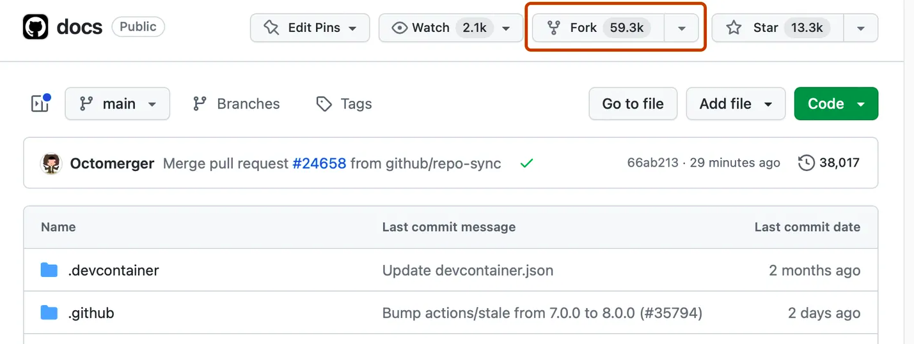
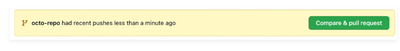

# Contributing to the CoLRev project documentation

To contribute to the project documentation, you need to sign in to GitHub and follow the steps below.

## Create a fork

- You do not have write access to the project repository
- Therefore, you need to create a fork of the project repository as follows:



## Add changes to a branch

- Now you can add changes in your fork
- You can now add a file:


- In just-the-docs, the pages should be in the `docs` directory, so start your file name with `docs/`
- For example, your filepath could be `colrev-docs/docs/faq.md` (it needs to end with `.md`)
- To display your content in the just-the-docs page, you need to start your file with a header as follows:

```
---
layout: default
title: Title of your topic
nav_order: 3
---

# Heading of your topic

... contents of your topic

```

- The contents should be in markdown format
- Group C1 (Goals): instead of creating a new file, edit the `index.md` file.

## Committing the changes

- When you are done with your changes, you need to commit them (using the green commit button on the top of the page)
- It is good practice to commit to a new branch (instead of the main branch)
- Once you committed the changes, you can modify the file again and create additional commits

Explanation:

- Separate branches are used to avoid diverging `main` branches between your fork and the project repository
- If you do not modify your `main` branch, changes that become available in the project repository can be pulled into your fork without merge commits or conflicts

## Creating a pull request

- Once you have completed your changes, you can create a pull request
- To create a pull request, navigate to the original project repository and click on `Pull requests` (next to `Code`):



- On the following page, you can provide a short summary of the changes you propose

