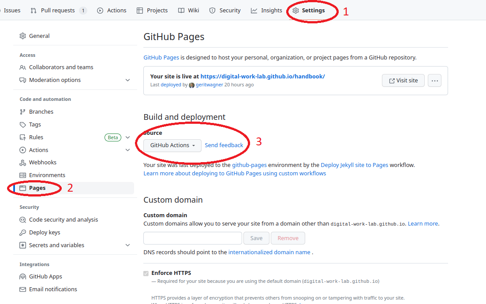
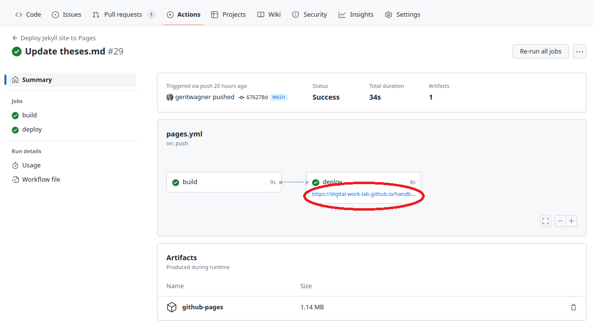
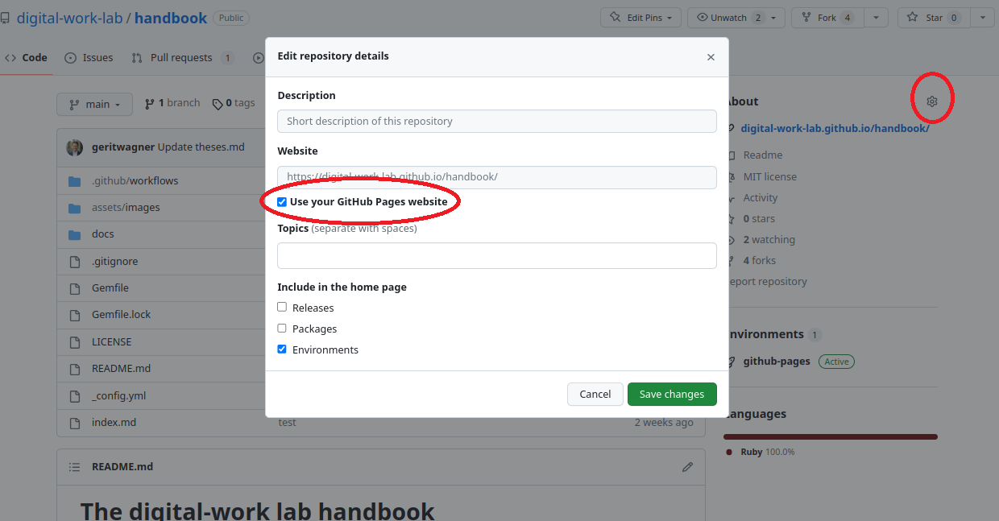
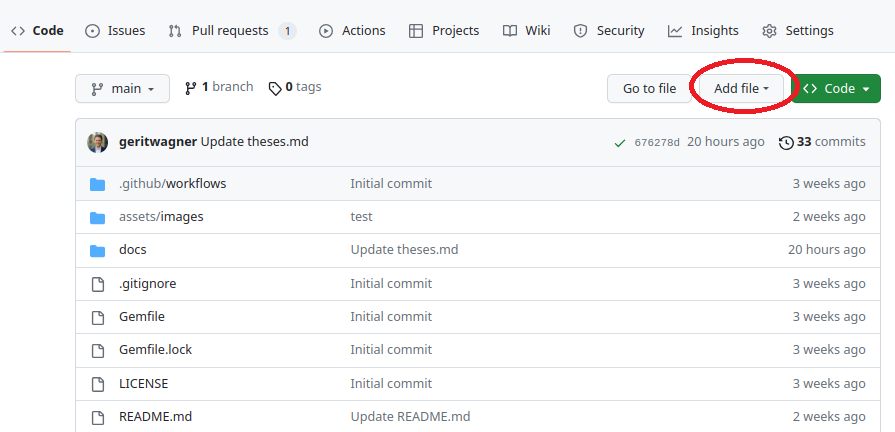

# Playbook M1: Setting up a documentation repository

- Read the playbook and prepare to complete the following subsection in front of the class (open the relevant websites in your browser).
- Login to GitHub.
- Select one maintainer who executes the steps on the computer.
- The other maintainers explain what is happening (e.g., switching after each section) and help the first maintainer if needed.

<!-- - Get the attention of the other groups before completing the following tasks. -->

## The setting

- Navigate to the [CoLRev project](https://github.com/CoLRev-Environment/colrev) and show the readme file (bottom of the page) to the class
- Explain that the goal of the project provides a tool for the literature review process, covering the search, the selection of relevant papers, the retrieval of PDFs, and the synthesis.
- State that the goal of the session is to create a documentation website for the project.
- Usually, this would be done in the same repository, but in this case, we will create a new repository for the documentation.

## The repository

- Navigate to [just-the-docs](https://github.com/just-the-docs/just-the-docs)
- Mention that this project provides a template for documentation websites. The setup is simple.
- Click on "use the template" to create a new repository based on the template
- Enter a name for the repository (`colrev-docs`) and click on "Create repository from template"
- Explain that the repository is now created and that we can see the files in the repository

## The hosting

- State that one benefit of GitHub is that it can host websites for free (called GitHub pages).
- To activate the hosting on GitHub pages:
    
    1. Navigate to the setting of the repository
    2. Click on `pages` (left panel)
    3. Select `Source:GitHub Actions`.



- Go back to the repository and show the file `.github/workflows/pages.yaml` (where the GitHub Action is defined)
- Go to `Actions` and show how the website is deployed
- Click on the first workflow and click on the link:



- The documentation is already available online.
- Go back to the project repository (`back` in the browser)
- Edit the `About` section on the right-hand side and activate the option `Use your GitHub Pages website` (this is how you can find the website quickly)



## Editing the docs

- Show that the contents on the GitHub page correspond to the `index.md` (in the repository)
- In the repository, go to the `index.md` file end edit it (using the pencil/edit symbol)
- Replace all content after the header (block containing `layout`, ..., `permalink`) with a short note "Coming soon (goals, faq, ...)"
- Commit the changes (using the green button)
- Go to the `Actions` tab and show that the website is being updated (after a few seconds)
- Show that the content of the docs-website is updated

## Adding new pages

- The goal is not just to edit existing pages, but also to add new pages.
- To create a new page, use the `Add file` button:



- As an example, create a file `colrev-docs/docs/faq.md`

```
---
layout: default
title: FAQ
nav_order: 2
---

# FAQ

```

- Commit and show changes on GitHub page (once the website is updated)
- Tell students that they will have a description of how to add and edit pages in their playbooks
- Mention that only the main branch will be deployed to the website

## Ask for contributions

- Ask students to go to the repository and start contributing
- Note that you will continue with the next round in 20 minutes

<!-- give @geritwagner access : not needed? - I can create issues without being a maintainer -->