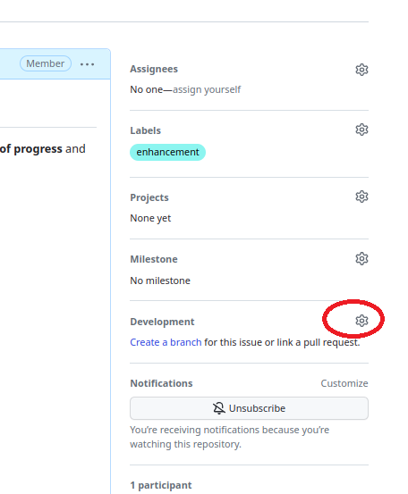
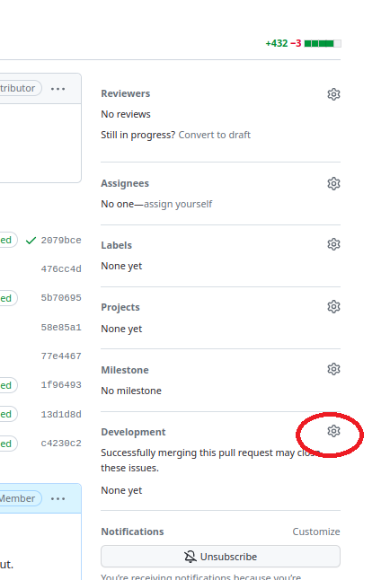

# Playbook M2: Reviewing and organizing contributions

- While the contributors are working on their ideas, you make your own plans for the project documentation. In particular, you think that three aspects should be covered prominently: (1) The goals of the project, (2) a guide on how to get started, and (3) an example illustrating how to use CoLRev. Create three issues for these aspects.
- Read the following playbook and prepare to complete the following subsection in front of the class.
- Remember that you can switch roles after each subsection.

## Your plans

- Get the attention of the other groups
- Share your ideas (the three issues)

## Community contributions

- State that you recognized incoming contributions from the community
- Navigate to the pull request area and check the pull requests
- Explain that it is useful to connect issues and pull requests (to get a better overview of the changes that are **requested** and the changes that are actually **proposed**)
- Go to the goals issue and link the corresponding pull request:



- Go to the pull requests
- Upon reviewing the changes, ask the group to briefly summarize their work
- Check whether the necessary header information is provided 
- Assign the pull-requests to the remaining issus 



## The changes that do not fit

- Recognize that one pull-request suggests to use CoLRev for interview data
- State that this is not in line with the goals of the project
- Politely decline the pull-request and add the `wontfix` label

- Note that not everyone can change the issues (balancing control and openness)

    - Everyone can comment (when logged in)
    - Only maintainers can assign issues and labels, or close the issue
    - Those who opened the issue can close it

## Next steps

- Summarize that the project is making good progress
- State that all files currently suggest the same `nav_order` value (in the header), so it would not be clear in which order the pages should be displayed:

```
---
layout: default
title: FAQ
nav_order: 2
---
```

- Assign reasonable `nav_order` values to each group by posting it in the pull request (e.g., "Please change the nav_order to ...")

- State that you will now review the contributions in more detail
- Ask the contributors to add links to the other pages

