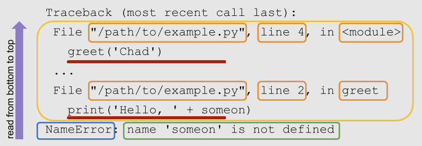

# Projekt: Einführung in Python

---

# Short group sessions

<!--
- who forked/leads
- clear announcement for overbooked groups

ask: who has a working machine? -> form groups around them!

https://github.com/dirediredock/PythonWorkshop

-->

---

# Learning objectives:

- Familiarize with Python syntax
- Learn good debugging and development practices
- Understand how to extend a Python package (CoLRev)

<!--
- Use google/Stackoverflow on any error/challenge that comes up!
- Using Code quality checkers and tests
-->

---

# Python

- Is an interpreted language: no need to compile (build jars) before running
- Uses indentation instead of brackets to separate blocks (such as if statements)
- Is strongly, dynamically typed.
- Provides access to many packages, covering machine learning, data science, web scraping, etc.

<!--

Java: compile the jar file 
Python: continuously developed

strongly typed:
- Explicit conversion required
- Python fails at runtime when asked to multiply/divide strings and strings. If you need the numbers stored inside a string variable, you need to cast it explicitly (`int_var = int("99")`).
- dynamically typed: typing information is only evaluated when running code (e.g., string * string in if-statement that is not evaluated does not fail)

Remember: call-by-value/call-by-reference

Our focus: using the programming language to build things (not to understand the programming language)

-->

---

- Form groups of three, discuss your solutions, and solve problems together.

<!-- 
FIRST: Who has a working machine?
-->
---

For the tutorial, we switch to the `python_tutorial` branch:

```
git clone https://github.com/CoLRev-Environment/colrev
cd colrev
pip install -e .
git fetch
git checkout tutorial_python
git reset --hard c9e305302eab9d3d1a25b399ad1a0b7dd48f929c
```

- As the session progresses, you can checkout the current commits.
- Whenever you see a `git reset --hard ...` command on the following slides, you can use it to set your repository to the required state (commit).

<!-- 
All: update colrev and reinstall with pip!

explain editable installation:
pip3 install -e .

git reset --hard HEAD~5 && git pull

Remember: what does the command do?

Note: you can also continue with your version and do the reset --hard at any time.

You will have all the code available to go over again / after this session
-->

---

# Important

- Create a separate **project directory** to run the colrev commands.
- To modify colrev functionality, switch to the **colrev package directory**.

<!-- 
Remember: cd ..., mkdir ... (open two shells)
-->

---

To run a Python script, simply run

```
python script.py
```

When a Python package (such as CoLRev) is installed, you can call it directly through the cli (providing parameters if necessary):

```
colrev status
```

<!-- Note : you can call installed python packages from any directory. scripts must be called by their relative/absolute path -->

---

# Step 1: Set up an entrypoint

We implement a simple version of CoLRev that should be available through a separate command:

```
colrev run
```

- Check the last commit and the changes that were introduced. Which function does our new `run` command call?
- Create the `run` module (module: file containing Python code) and the function that should be called. The function should print `Start simple colrev run`. Note that calling `colrev.ops.run.main()` means that colrev will try to import and run the `main()` function in the `colrev/ops/run.py` module. Check the other functions in the `ui_cli.py` and the other modules in the `colrev/colrev` directory if necessary.
- Create a commit once the command works.


<!-- 

explain 
__main__

-> commit: pre-commit hooks!
-> explain later (they do some formatting and warn us if there are code quality issues)

Goal: orientation/read code, try to figure out things
-->

---

Dictionaries are efficient data structures, which can be used to handle bibliographic records, such as the following (in BibTex format):

```
@article{Pare2023,
  title   = {On writing literature reviews},
  author  = {Pare, Guy},
  journal = {MIS Quarterly},
  year    = {2023}
}
```

Create a dictionary containing these data fields and print it when `colrev run` is called.

Note: You can find the syntax for Python dictionaries (and many other data types) in the [W3School](https://www.w3schools.com/python/python_dictionaries.asp).

---

Next, we need a field indicating the record's status throughout the [process](https://colrev.readthedocs.io/en/latest/manual/operations.html).

Add a `colrev_status` field to the dictionary, and set its value to `md_imported`. Create a commit once the command prints the following:

```
Start simple colrev run
{'ID': 'Pare2023', 'title': 'On writing literature reviews', 'journal': 'MIS Quarterly', 'year': '2023', 'author': 'Pare, Guy', 'colrev_status': 'md_imported'}

```

$\hspace{8cm}$

To checkout the solution, run:
```
git reset --hard fc6bef2a8d8e43062b67205931bb12d6c6d5ffe9
```

<!-- To reset, run: 

clarify state transitions
-->
---

Next, we decide to load (parse) a BibTeX file stored in the project. Search for an appropriate Python library to parse BibTeX files. Try to figure out how to install it and how to use it.

<!-- 
after 2-3 minutes: write BibtexParser on the blackboard
-->
---

We decide to use the [BibtexParser](https://github.com/sciunto-org/python-bibtexparser) package, which developed actively and available under an Open-Source license.

To install it, we could follow the instructions and run

```
pip install bibtexparser
```

To add it as a dependency of CoLRev and make it available for users of the CoLRev package, we run
```
poetry add bibtexparser
```

Check the changes and create a commit.

To checkout the solution, run:
```
git reset --hard f2318ba15731b16c6feed51f551ca55350529382
pip install -e .
```

---

Go to the [bibtexparser tutorial](https://bibtexparser.readthedocs.io/en/master/tutorial.html) and figure out how to load a BibTeX file. An example `records.bib` file is provided in the VC course.

Instead of defining the dictionary in the `run.py`, use the bibtexparser to load the `records.bib` file. Remember to store the `records.bib` in the **project directory**. 

Afterwards, loop over the records (`for ...`) and print the title of each record.

Create a commit, and try to resolve linting errors (if any). We will address the [typing](https://realpython.com/python-type-checking/)-related issues together.

To checkout the solution, run:
```
git reset --hard 10eb0fd980e14f0e414b53a07d13db2c1674b1d7
```

<!-- 
clarify:
- call by value/reference
- keyword vs positional arguments

example:
************* Module colrev.ops.built_in.search_sources.aisel
colrev/ops/built_in/search_sources/aisel.py:225:19: W3101: Missing timeout argument for method 'requests.get' can cause your program to hang indefinitely (missing-timeout)
-->
---

Next, we would like to create a function, which adds a `journal_impact_factor` field based on the following table:

| journal | JIF |
| ------- | ---|
| MIS Quarterly | 8.3|
| Information & Management | 10.3 |


Add your changes to the staging area and run the pre-commit hooks:

```
pre-commit run --all
```

To checkout the solution, run:
```
git reset --hard b37f11169d06b0e9d9074e444507dd73fe949ef4
```

<!-- 
Note: Pfeil-nach-oben-Taste oder bash alias nutzen!
-->

---

# Best practices

- Carefully read tutorials, vignettes, and code examples (e.g., on GitHub) 
- Start with code examples, try whether they work, and extend them
- Use code linters to ensure high code quality
- Add or commit working code frequently
- To debug code, check whether variables have the expected values (use assert statements)
- When exceptions are thrown, read the Traceback:



<!-- 
small examples: clarify the "big goal" and start with small steps
linters: already installed


Code highlighting (visual studio): functions yellow, variables light blue, instances blue, classes green, strings orange
python debuggers/plugins (for regular Python programming / special cases like memory usage or distributed systems)
-->

---

# Next session

- May 5
- Make plans on how to split and distribute tasks: which CoLRev-objects or libraries will be needed, which steps are required?

---

# Object-oriented programming and extending a Python package (CoLRev)

To use the typical CoLRev environments (objects), we switch to an existing CoLRev project:

```
cd ..
git clone git@github.com:CoLRev-Environment/example.git
cd example
colrev status
```

Briefly check the last commits of the project.

<!-- 
See how far we get...
-->

---

Our next goal is to implement the previous example (adding the journal impact factor to the records) using Python objects/methods, and using the CoLRev infrastructure.

As a first step, create the `JIFLabeler` class, instantiate an object, and add the `add_jif()` method (based on the [Python objects/methods syntax](https://www.w3schools.com/python/python_classes.asp)). Run and revise the code (if necessary).

Note: Also adapt the path of the records to `data/records.bib`. This is where CoLRev projects store the main records file.

To checkout the solution, run:
```
git reset --hard a4c131dafb574946f346c06480ce0a68e66fe1a2
```

<!-- 
Imporant: try to program using objects (instead of procedural programming)

if record["journal"] == "MIS Quarterly":
KeyError: 'journal'
-> if statement (better: if "jounal" not in record: return)

Notice: when creating the run() method, the jif_labeler_instance switches to "self".
-->
---

To use the CoLRev infrastructure, take a look at the [API reference](https://colrev.readthedocs.io/en/latest/foundations/api.html) and find the classes and methods that can be used to load and save records.

<!-- 
go to API reference
navigate through the classes / dataset
-->
---

Upon instantiating the `JIFLabeler`, we would like to instantiate a `ReviewManager` object and keep it as an object variable.

When calling the main method, the records should be loaded by using the `ReviewManager`'s dataset methods.

Note: Remember to import the required modules. Test your code, run the linters, and try to address potential warnings.

To checkout the solution, run:
```
git reset --hard 4a84733b1f0ecfb95760bf97f9d3597abbac2980
```

<!-- 
-> switch to review_manager ()
-->
---

Before completing the task, we need to implement two changes:

- Instead of `print()` statement, it is recommended to use the `ReviewManager`'s logger.
- Instead of using the record dicts, it is recommended to work with the `Record` class and its `update_field()` method.

To checkout the solution, run:
```
git reset --hard 56ca7df0148c0f8116d63d9b403facdf05878c28
```

<!--
run the pre-commit hooks a few times to illustrate the typing information
-->
---

Finally, we need to save the records (using the `dataset` class) and create a commit (using the `ReviewManager` class).

Review the commit and its content.

To checkout the solution, run:
```
git reset --hard ed1e73d621f28e9447b48349843185d0cfd4709e
```

<!-- 

TBD:
  - search: run an api-search example, examine the commit message (settings changed! -> reference implementation)
-> we add a query -> docs: interface definitions: searchsource.add_endpoint(), run_search()
  -> see interfaces (standardized function parameters/names)
  - where to find the built_in reference implementation (docs/architecture and directories), how to add/remove in the settings
  -> see package_endpoint definitions (package_manager, docs)

  continue: prep/validation

  continue to data: show advice?

later: show debugging
-->

---

# Resources

Introductory:

- [Python challenges](https://pythonprinciples.com/challenges/)
- [Python CheatSheets](https://quickref.me/python)
- [11 tips for Python beginners](https://realpython.com/python-beginner-tips/)
- [PEP 8 — the Style Guide for Python Code ](https://pep8.org/)

More advanced:

- [The Hitchhiker's Guide to Python](https://docs.python-guide.org/)
- [RealPython Tutorials](https://realpython.com/)
- [Python design patterns](https://refactoring.guru/design-patterns/python)

<!-- 
add resources on learning/practicing Python (introductory, advanced)
check: 
-->

---

# Next: Hacking sessions (per group)

- May - June
- Make plans on how to split and distribute tasks.
- Consultation sessions: Monday-Thursday (16.00), by appointment

<!-- 
Pair-programming

which CoLRev-objects or libraries will be needed, which steps are required

- Create a fork for the team, give access to team members, and add a note to the issue feed
- All team members: clone the fork (using `git clone git@github.com:CoLRev-Environment/colrev.git`)
- Check the resources provided with the issue, discuss the project, and make plans
-->
