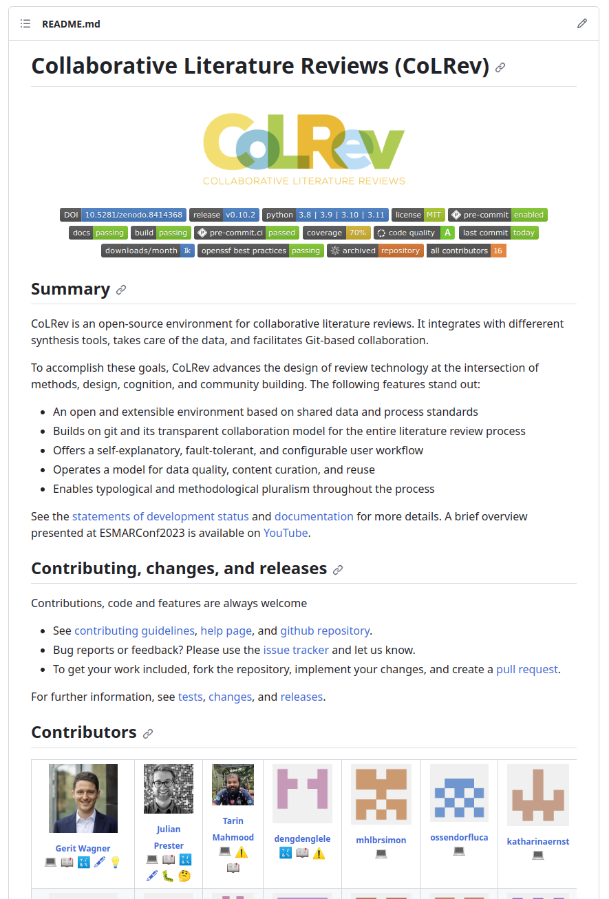

<!-- paginate: true -->

<!-- _class: centered -->

# WI-Project: Open-Source Project

## Topics

Prof. Dr. Gerit Wagner
Faculty Information Systems and Applied Computer Sciences
Otto-Friedrich-Universität Bamberg

---

# Your instructor

- Prof. Dr. Gerit Wagner
- At Bamberg University since October 2022
- I work with Git, Python, and R since 2014
- I enjoy coding, solving programming puzzles, and building tools
- My latest and most significant project: **CoLRev**

---

# What you will learn (I): Git/GitHub

- Use git and GitHub for versioning and collaboration
- Git quickly established itself as the most popular version control system
- As a prominent example, Microsoft has acquired GitHub and moved the source code of Windows to Git ([1](https://www.golem.de/news/gvfs-windows-team-nutzt-fast-vollstaendig-git-1705-128039.html))
- Many companies have public GitHub programs and share parts of their work as Open-Source (e.g., [Google](https://github.com/google) or [Meta](https://github.com/facebook)) 

---

# What you will learn (II): Python

- Write Python code and contribute to a Python package
- Python is the leading programming language in several rankings, including the [TIOBE Index](https://www.tiobe.com/tiobe-index/) and the [PYPL (PopularitY of Programming Language)](https://pypl.github.io/PYPL.html) ranking
- Job requirements for **Data Scientists**, **Full-stack Software Engineers**, **DevOps Engineers**, or **Data Engineers** commonly include Python ([1](https://de.indeed.com/jobs?q=Python))

---

# What you will learn (III): Open-Sourcing

- Work with the Open-Source workflows of GitHub
- Make a first contribution to a public Open-Source project
- Adopt the role of a maintainer and review the code of your peers
- Have an opportunity to create your *developer portfolio*

---

# The project: CoLRev

Collaborative Literature Reviews (CoLRev) is an open-source environment for collaborative literature reviews. It integrates with different synthesis tools, takes care of the data, and facilitates Git-based collaboration.

The following features stand out:

- Supports all literature review steps: problem formulation, search, dedupe, (pre)screen, pdf retrieval, and preparation, and synthesis
- An open platform based on shared data and process standards
- Builds on git and its transparent collaboration model for the entire literature review process
- Focus: command-line interface

---

# Agenda

Dates and rooms are available [online](https://digital-work-lab.github.io/open-source-project/#outline).

---

# How groups will form

You **assign yourself to a group** when you contribute code, following these steps:
1. **Signal your intent** to contribute by joining the issue discussion on GitHub (in the [issue discussion](https://github.com/CoLRev-Environment/colrev/milestones), before the **Git Session**, for two topics at most).
2. **Organize your work**, meet potential group members, and select a project leader (in the following sessions). Keep in mind that **no more than 5 people** will be accepted per group.
3. **Officially sign up for a group** by contributing a non-trivial code part (\*). Team member's contributions must be made in separate commits. Select a project lead who sends your GitHub-ID together with a link to your code contribution, your student ID, and e-mail address to [gerit.wagner@uni-bamberg.de](mailto:gerit.wagner@uni-bamberg.de).

This process ensures that **all group members contribute fairly**, as typically, **a single grade is given for the entire group**. However, if issues arise, it's essential to raise concerns early. We reserve the right to adjust the grading policy as needed, including assigning different grades within the group and awarding a bonus to those who make exceptional contributions.

> \* You can only contribute to a group if you have signalled your intent in the issue discussion before.

---

# Evaluation criteria

**Code: Functionality**

- Correct implementation of the specified features in a CLI interface, which validates input parameters.
- Unit tests covering critical parts of the code.

**Code: Quality**

- Adherence to Python coding standards, as defined in the pre-commit hooks in the repository.
- Documentation, with detailed docstrings for all functions and classes, and a README explaining the setup, and usage.
- Code structure and readability.

**Process: Open-Source Practices**

- Proper use of Git conventions for commit messages, branching, and pull requests.
- Participating in the community by reviewing others' code, providing constructive feedback, and incorporating feedback.
- Maintaining an active and professional presence in project discussions and issues.

---

# How you can make the project a success

- Embrace the challenge and adopt a problem-solving mindset
- Take full responsibility for setting up your programming environment
- Be prepared. Know your code, be able to explain it, and ask prepared questions (Google it, consider different options)
- Do not use generative AI such as ChatGPT (risk of copyright infringement)
- Adopt an Open-Source approach (work publicly, communicate in English, create a profile)
- Reach out and schedule individual hacking sessions via [Calendly](https://calendly.com/gerit-wagner/30min) to discuss challenges and get feedback

---

# Finding things in an Open Source project

Go to the [CoLRev project repository](https://github.com/CoLRev-Ecosystem/colrev).

Form groups of three and try to find the following information in 10 minutes:

1. How many commits, contributors, and downloads does the project have? What is the test coverage?
2. How does CoLRev compare to related tools? Which tool would you choose and why?
3. Where is the documentation, and how can I install CoLRev?
4. What is the license, and where can we find information on how to contribute to the project?
5. What information should be provided for bug reports, where can I open a feature request?
6. How many issues are open vs. closed? How many pull requests are open vs. closed?
7. How long do workflows with tests or code formatting run, when did the last one fail?
8. What is "unpaywall" used for in the project?
9. Where can we find the features planned for the next milestone?

---

# Until next session

**Familiarize yourself with the CoLRev documentation**

- An overview of the [process](https://colrev-environment.github.io/colrev/manual/operations.html) and the [workflow](https://colrev-environment.github.io/colrev/manual/workflow.html) are available in the documentation.

**Find a topic**

- Go to the upcoming [milestone](https://github.com/CoLRev-Environment/colrev/milestones) and read the open issues (available topics).
- Comment on the issues to find others who are interested in the same topic.

**Complete the setup**

- Register for VC course: [here](https://digital-work-lab.github.io/open-source-project/#participate)
- Create a GitHub account (using your student e-mail address) to use [Codespaces](https://github.com/features/codespaces) in the next sessions
- Read [how to use Codespaces](https://digital-work-lab.github.io/open-source-project/docs/week_1_codespaces.html)

> Challenge (optional): You can **set up your programming environment** (see instructions in the [CoLRev documentation](https://colrev-environment.github.io/colrev/dev_docs/setup.html)). This requires you to install and configure Git, Docker, pre-commit hooks, and venv. It will give you more control over and a deeper understanding of your programming environment.

---

# We value your feedback and suggestions

We encourage you to share your feedback and suggestions on this slide deck:

<a href="https://github.com/digital-work-lab/open-source-project/edit/main/slides/01-topics.md" target="_blank">
   Suggest specific changes by directly modifying the content
</a>
 
<a href="https://github.com/digital-work-lab/open-source-project/issues/new" target="_blank">
   Provide feedback by submitting an issue
</a>
 

Your feedback plays a crucial role in helping us align with our core goals of **impact in research, teaching, and practice**. By contributing your suggestions, you help us further our commitment to **rigor**, **openness** and **participation**. Together, we can continuously enhance our work by contributing to **continuous learning** and collaboration across our community.

Visit this <a href="https://digital-work-lab.github.io/handbook/docs/10-lab/10_processes/10.01.goals.html" target="_blank">page</a> to learn more about our goals:  🚀 🛠️ ♻️ 🙏 🧑‍🎓️ . 
