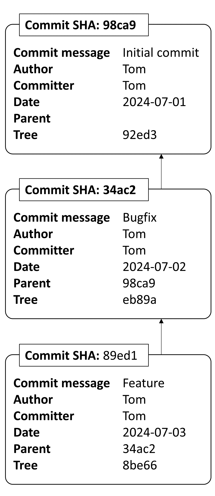
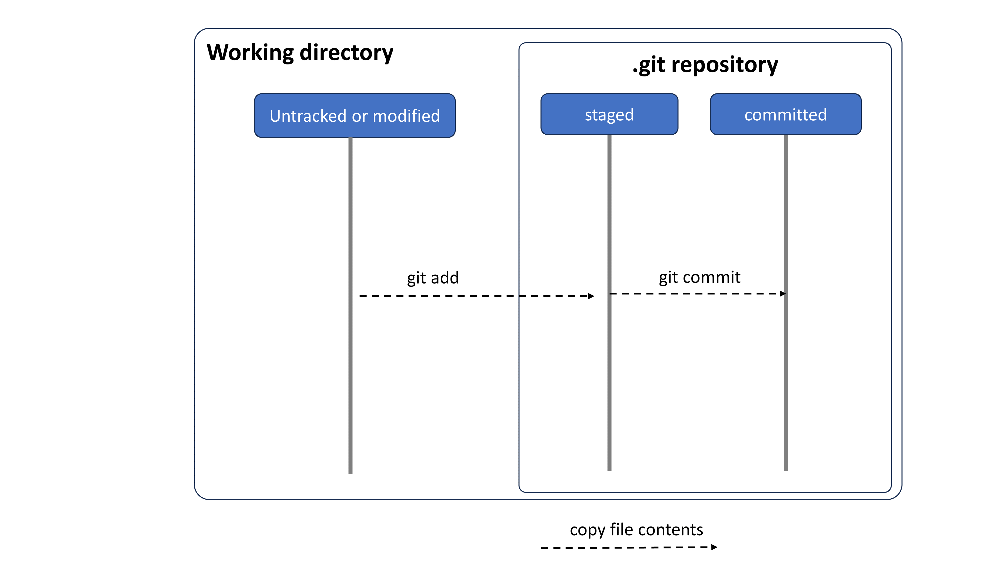
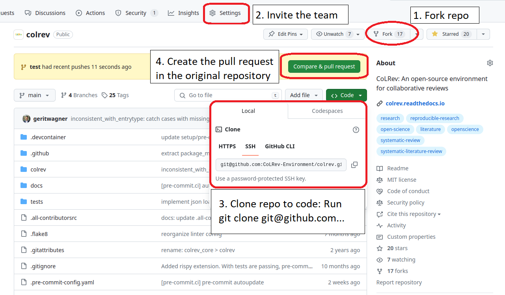
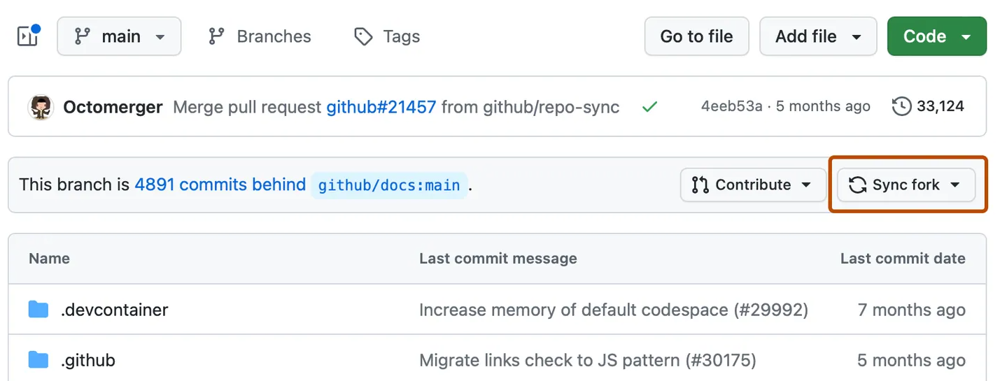

<!-- _class: centered -->

# WI-Project: Open-Source Project

## Introduction to Git

Prof. Dr. Gerit Wagner
Faculty Information Systems and Applied Computer Sciences
Otto-Friedrich-Universität Bamberg


---

# Check-in: Group formation

- [Milestone](https://github.com/CoLRev-Environment/colrev/milestones)
- Anyone not yet part of an issue discussion?
- Challenges related to the setup?


---

# Git: A distributed version control system

Advantages:

- Every repository has a full version history
- Most operations run locally
- Reliable data handling, ensuring integrity and availability
- Efficient data management for versions and branches
- Scalable collaboration mechanisms for large teams and complex projects

Caveats:

- Need to learn and understand the underlying model
- Not built for binary files or large media files


---

<style>
blockquote {
    border-top: 0.1em;
    font-size: 60%;
    margin-top: auto;
}
</style>

# Learning objectives

Understand and use git to develop software in teams.

**Part 1**: Branching
**Part 2**: Committing
**Part 3**: Collaborating

Each part starts with the **concepts** before the **practice** session.

In the practice sessions:

- Form groups of two to three students
- Work through the exercises
- Create a *cheat sheet* summarizing the key commands


> \* Note: This session is based on our [unique and peer-reviewed approach](https://digital-work-lab.github.io/rethink-git-teaching/).

---

# Start the Codespace

Open the notebook for practicing Git branching:

[](https://digital-work-lab.github.io/open-source-project/docs/week_2_git_notebook_branching.html)

---

<!-- _class: centered -->

# Part 1: Branching

---

# Commits

<style>
blockquote {
    border-top: 0.1em;
    font-size: 60%;
    margin-top: auto;
}
</style>

- A **commit** refers to a snapshot (version) of the whole project directory, including the metadata and files
- The **tree** object contains all files (and non-empty directories); it is identified by a SHA hash
- Commits are created in a sequence, with every commit pointing to its **parent** commit(s)
- Commits are identified by the **SHA** fingerprint of their metadata and content\*, e.g., `98ca9`
- Commits are created by the **git commit** command



> \* If any of the metadata or content changes, the SHA will be completely different.

---

<style>
blockquote {
    border-top: 0.1em;
    font-size: 60%;
    margin-top: auto;
}
</style>

# The DAG, branches, and HEAD

- Commits form a **directed acyclic Graph (DAG)**, i.e., all commits can have one or more children, and one or more parents (except for the first commit, which has no parent). Closed directed cycles are not allowed.
- With the **git branch \<branch-name\>** command, a separate line of commits can be started, i.e., one where different lines of commits are developed from the same parent. The branch pointer typically points at the latest commit in the line.
- With the **git switch \<branch-name\>** command, we can select the branch on which we want to work. Switch effectively moves the HEAD pointer, which points to a particular branch and indicates where new commits are added.
- With the **git merge \<other-branch\>** command, separate lines of commits can be brought together, i.e., creating a commit with two parents. The *merge commit* integrates the contents from the *\<other-branch\>* into the branch that is currently selected. The *\<other-branch\>* is not changed. 
- Per default, Git sets up a branch named "main".

> Note: Arrows point from children to parent commits.


---

# Practice: Branching

Open the notebook for practicing Git branching:

[](https://digital-work-lab.github.io/open-source-project/docs/week_2_git_notebook_branching.html)

---

<!-- _class: centered -->

# Part 2: Committing

---

<style>
blockquote {
    border-top: 0.1em;
    font-size: 60%;
    margin-top: auto;
}
</style>

# The working directory and .git repository

All working file contents reside in the working directory; staged and committed file contents are stored in the `.git` directory (a subfolder of the working directory).

- With **git init**, the `.git` directory is created.

Git allows us to stage (select) specific file contents for the next commit.

- With **git add \<file-name\>**, contents of an *untracked or modified* file are copied to the `.git` repository and added to the staging area, i.e., explicitly marked for inclusion in the next commit.
- With **git commit**, *staged* files contents are included in a *commit*.



> \* Note: Git only keeps track of files that are explicitly *added*. *Untracked* files are not part of the `.git` repository, i.e., not included in the version history and not shared when the repository is synchronized. Files must be *untracked* explicitly, as shown on the next slide. Git only keeps track of files, not (empty) directories.

---

<style>
blockquote {
    border-top: 0.1em;
    font-size: 60%;
    margin-top: auto;
}
</style>

# The three states of a file

Files in the working directory can reside in three states:

- New files are initially **untracked**, i.e., Git does not include new files in commits without explicit instruction.
- With *git add*, file contents are staged, and the file is tracked. Given that the file in the working directory is identical with the staged file contents, the file is **unmodified**.
- When users change a file, it becomes **modified**, i.e., the file in the working directory differs from the file contents in the staging area.
- With *git add*, the file contents are staged again, and the file becomes **unmodified**.
- With *git rm*, files are no longer tracked.


> \* Note: *git add* and *git rm* do not change the contents of the file in the working directory.

---

# Resetting changes

To undo changes that are not yet committed, it is important to understand whether they are staged or unstaged:

- If changes are not yet staged, the file is currently *modified*. A **git restore \<file-name\>** replaces the file in the working directory with the staged version. As a result, the file is *unmodified* because it corresponds to the staged file.
- If the file is currently *unmodified*, a **git restore --staged \<file-name\>**, Git discards the staged changes by using the last committed version. The file contents in the working directory do not change, but the file becomes *modified* because it differs from the staged version.


---

# Practice: Committing

Open the notebook for practicing Git committing:

[](https://digital-work-lab.github.io/open-source-project/docs/week_2_git_notebook_committing.html)

---

# Transfer challenges I 


Consider how the **git switch** (or the revert/pull/checkout) command affects the git areas. How does it affect the working directory?

<!--
Do you see any challenges?
- Try to reproduce the situation
(stash) 

2. Git provides the option to edit prior commits using an interactive rebase, such as the **git rebase -i**. How would that affect the following commits?

git questions: understand linearized git history displayed on github / reading gitk DAG

Illustrate on the whiteboard : new/alternative commit with the same parent, all following commits are applied on top of the new commit
- commit SHAs change!
- Refer to the slide on commits
- Maybe even illustrate 
-->

---

# Transfer challenge: Git merge conflicts

Open the notebook for practicing the resolution of Git merge conflicts (related to branching and committing):

[](https://digital-work-lab.github.io/open-source-project/docs/week_2_git_notebook_merge_conflict.html)

---

<!-- _class: centered -->

# Part 3: Collaborating

---

# Collaborating

- The distributed model of Git means that every repository has a full version history, (almost) all operations can be completed locally, and every repository can be developed autonomously.
- To collaborate, a *remote* repository is needed, initially named "origin"
- If the remote repository exists, the **git clone** command retrieves a local copy
- To create a remote repository (named "origin"), and push a specific branch:

```
git remote add origin REMOTE-URL
git push origin main
```

> \* If the remote repository does not exist, you have to add the remote origin and push the repository.<br> \* The REMOTE-URL must be an ssh url. Otherwise, changes cannot be pushed.


---

# Collaborating on branches

- To retrieve changes, use the **git pull** command
- To share changes, use the **git push** command

- Most remote operations, including pull, push, pull requests refer to branches
- In some cases, **branches must be selected explicitly**, and in other cases, git automatically selects branches, i.e., it remembers the typical branch to pull or push


---

# Collaborating with forks

This model works if you are a maintainer of the remote/origin, i.e., if you have write access.

- In Open-Source projects, write-access is restricted to a few maintainers
- At the same time, it should be possible to integrate contributions from the community
- **Forks** are remote copies of the upstream repository
- Contributors can create forks at any time and push changes
- Contributors can open a **pull request** to signal to maintainers that code from the fork can be merged
- Pull requests are used for code review, and improvements before code is accepted or rejected


---

# Fork, invite, clone, and pull-request on GitHub



> (3.) You only need to *clone* the repository explicitly if you work in a local setup. If you start a Codespace, this is done automatically.

---

# Work in a forked repository



- In the fork, it is recommended to create working branches instead of committing to the `main` branch.
- It is good practice to regularly **sync** the `main` branches (on GitHub), and merge the changes into your working branches (locally or on GitHub).
- Syncing changes may be necessary to get bug fixes from the original repository, and to prevent diverging histories (potential merge conflicts in the pull request).


<!-- 

# Remotes and branches

- Most remote operations, including pull, push, pull requests refer to branches
- In some cases, **branches must be selected explicitly**: pull requests, or pulling new branches
- In other cases, git automatically selects branches, i.e., it remembers the typical branch to pull or push


---

# Transfer challenges II

- Once a pull request has been opened, how can new changes (commits) be added?

- Assume that you discovered a typo in a very old commit. One option would be to run an interactive rebase and fix the typo. Why could such cases of "rewriting history" be problematic in collaborative settings?

- When pulling changes, there are two strategies to handle diverging branches: ``--merge`` or ``--rebase``. How do the results differ between these strategies?


Note: pull requests are just pointers (like branches/HEAD, they move with the branch)
 pull --rebase (we discussed interactive rebase before) 

- GitHub offers the possibility to edit files directly. Are all three git areas available in this setting?
 -->

---

# Practice: Collaborating

This notebook is not part of the Git session and is intended for you to work on independently at home. If you have any questions, feel free to bring them up at the beginning of the next Python session. We’ll be happy to discuss them then!

[](https://digital-work-lab.github.io/open-source-project/docs/week_2_git_notebook_collaboration.html)

---

# Try CoLRev

We have prepared a tutorial for CoLRev:

- [colrev-tutorial](https://github.com/CoLRev-Environment/colrev-tutorial). It contains a notebook (`.devcontainer/tutorial.ipynb `) explaining how to set up a CoLRev repository, complete the different steps, and analyze how the dataset changes. 
- In addition, a brief overview is available on [YouTube](https://www.youtube.com/watch?v=yfGGraQC6vs).

We invite you to work through the notebook before the next session.

---

# Survey

Please share your feedback to help us improve!

[Survey on the Git Introduction](https://survey.ism.uni-bamberg.de/index.php/994884?lang=en)

---

<style>
blockquote {
    border-top: 0.1em;
    font-size: 60%;
    margin-top: auto;
}
</style>

# Project organization

- Select a team leader who creates the fork and invites group members
- Plan how tasks could be completed in separate branches
- Avoid working on the `main` branch and synchronize it regularly with the original repository
- Regularly check whether branches should be synchronized (merged)

**Remember to delete the codespace!**
