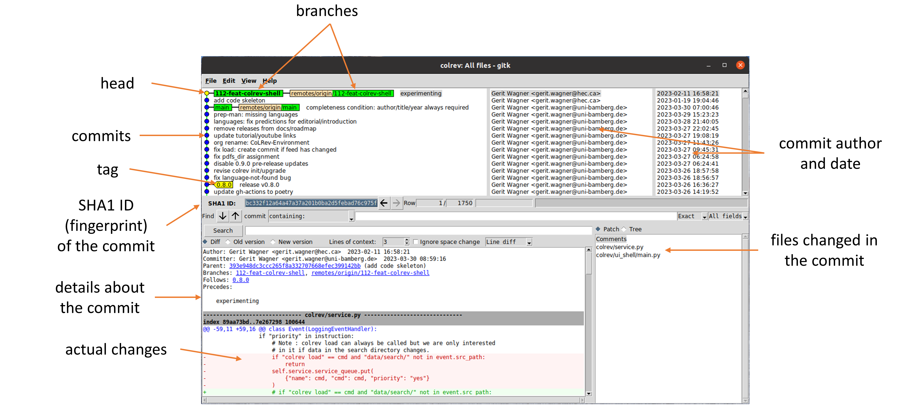

```shell
git status
```

This command provides an overview of the current state of the project and the files in the three sections. Therefore, you will need to run ``git status`` regularly.

**Check**: It should print something like the following:

```
On branch main
Your branch is up to date with 'origin/main'.

nothing to commit, working tree clean
```

The last line indicates that there are no changes in the staging area (nothing to commit). The working directory has the same content as the last version in the git respository (working tree clean).

---

Take a look at the files and directories that were retrieved as part of the CoLRev project.

Git stores its data in the `.git` directory. It can be instructive to explore how git handles data internally, but keep in mind that manual changes in the `.git` directory may break the repository.

**Note**: If you work on your own machine and Git is not yet configured, you need to run ``git config --global user.name "John Doe"`` and ``git config --global user.email johndoe@example.com`` to configure your user name and email.


<!-- 
We start with the setup of a git repository

Start with the slide, after 2 minutes: ask who has already completed the step/who needs help
Then: proceed: step-by-step with the following slides
-->

---

Next, we modify files (state: **untracked**/**modified**), mark them to be in the next commit (state: **staged**) and create the first version (state: **commited**). This corresponds to the three sections of a git project.

- Open the `README.md` file and add your name to the list of contributors (`# Contributors` section).

```
git status              # Check the `git status` between each command
```

- Open the `CONTRIBUTING.md` file and change it.

**Check**: The `git status` should now show two files with changes in the working directory (state: **modified**).

---

We decide that the changes in the `README.md` file should be staged for the next commit. The changes in the `CONTRIBUTING.md` file are no longer needed. Use the commands suggested by `git status` to accomplish this.

**Check**: The `git status` should now display 

```
On branch main
Your branch is up to date with 'origin/main'.

Changes to be committed:
  (use "git restore --staged <file>..." to unstage)
	modified:   README.md

```

This means that changes in the README.md are **staged** (to be committed).

---

To create the commit, we run

```
git commit -m 'add contributor'
```

The `-m 'add contributor'` adds a short summary message, which is expected for every commit.

**Check**: `git status` should reflect your expected state of files in the three git sections.

---

Sh***! We just committed changes containing an error 🤯

To undo the last commit, we can simply run:

```
git reset --soft HEAD~1
```

You should now have the `README.md` file in the staging area again.

**Note**: the `HEAD~1` refers to the last commit.

**Check**: Run `git status` to see the changes.

---

We decide to discard our changes. Use the commands suggested by `git status` to do that.

**Check**: The git status should show the following:

```
On branch main
nothing to commit, working tree clean
```

<!-- 
```
                              # Manually create a REAMDE.md file in the project.
git status                    # Should show the README.md file as "untracked"
git add README.md             # Add the README.md file using the `git add` operation
git status                    # Should show the README.md file as a change "to be committed" (staged)
                              # Download the MIT license file from https://choosealicense.com/licenses/mit/
                              # Save it as `LICENSE` (filename) and 
git add .                     # add all changes to the staging area
git status                    # Should now show two files "to be committed" (staged)

git commit -m 'Initial comit' # Create the first commit (version of the project)
git status                    # Should show a clean working directory and staging area
```

---

-->
<!-- 

Instead of modifying the files manually, we can also apply patches (i.e., files containing changes):

```
git apply ../git-tutorial-example/setup.patch
git status                                   # See which files were changed
git add .                                    # Add all changes
git commit -m 'Add code'                     # Create the first commit (version of the project)
```

In the following, we work with patches to save time while creating changes that resemble a software development project. 

**Check**: The commands did not produce any error messages.

For the next steps, download the code for [colrev](https://github.com/CoLRev-Ecosystem/colrev) as a zip file (through the `Code` button), extract the files and move them to your `colrev_project` directory*. Add all changes and create a new version. -->

---

Let's see the changes that were committed in the project.

To analyze the specific changes, open `gitk` (or another Git GUI):

```
gitk
```

- Check which files were added and modified by the last commit
- Check the code that was modified (increase and decrease lines of context in gitk). The next page provides an overview of gitk (other Git GUIs have similar interface elements).

---



<!-- 
gitk.png screenshot + add explanations similar to https://lostechies.com/joshuaflanagan/2010/09/03/use-gitk-to-understand-git/
-> highlight that versions are identified by their commit-ID/sha-fingerprint

TODO : create another version and check how gitk displays the unstaged/staged changes
 -->

<!-- 
---

Go to the [colrev](https://github.com/CoLRev-Ecosystem/colrev) project on GitHub and explore the version history.
- Navigate to `commits` and check which files were modified in the most recent version
- From the [main page](https://github.com/CoLRev-Ecosystem/colrev), navigate to `colrev/dataset.py` and click on `Blame` to see what revision and author last modified specific lines of code

**Check**: When was the `load_records_dict` function last modified?

Note : patches allow us to work with more substantial examples in the following
-->

---

To create atomic commits, you may need to **add specific lines of code that should go into a commit**, leaving other changes in the working directory.

The changes are provided in the [`rec_dict.patch`](../assets/rec_dict.patch) file, which must be placed in the project's working directory. To apply it, run:

```
git apply rec_dict.patch                # Suggests to rename the method but also introduces unrelated changes.
git status                              # Different files were modified by the patch
gitk                                    # Check the changes that were introduced by the patch
```

In the following, we would like to add *only* the changes in lines related to the `load_records_dict` method and the `skip_notification` parameter (using `-p` for a partial `git add`):

```
git add -p colrev/dataset.py            # Add specific lines of code from the colrev/dataset.py
                                        # using y/n to add or skip (confirming with ENTER)
gitk                                    # Check whether the correct lines were added
```

Create a commit containing the relevant changes. Afterwards, discard the remaining changes.


<!--
**Check**: The working directory should be clean again.
 TODO : link to good commit messages

git diff > rec_dict.patch
 
 -->

---

When writing code, we can make mistakes, or we may need to undo or modify previous changes. To undo changes, it is important to understand whether they are unstaged, staged, or committed.

To **undo unstaged or staged changes**, `git status` suggests the corresponding operations (`git restore <file>` and `git restore --staged <file>`). To see how `git restore` works:

- Modify the `README.md` file and add the changes to the staging area
- Undo the staged changes
- Undo the unstaged changes

**Check**: The working directory should be clean again.

---

To **undo committed changes**, there several options (some are available in gitk):

- Revert the commit, i.e., create a new commit to undo changes: `git revert COMMIT_SHA --no-edit`
- Undo the commit and leave the changes in the staging area: `git reset --soft COMMIT_SHA` (*)
- Stage changes, and run `git commit --amend` to modify the last commit (*)

If you have the time, try the different undo operations in the session.

(*) Important: only amend commits that are not yet shared with the team. Otherwise, revert is preferred.
