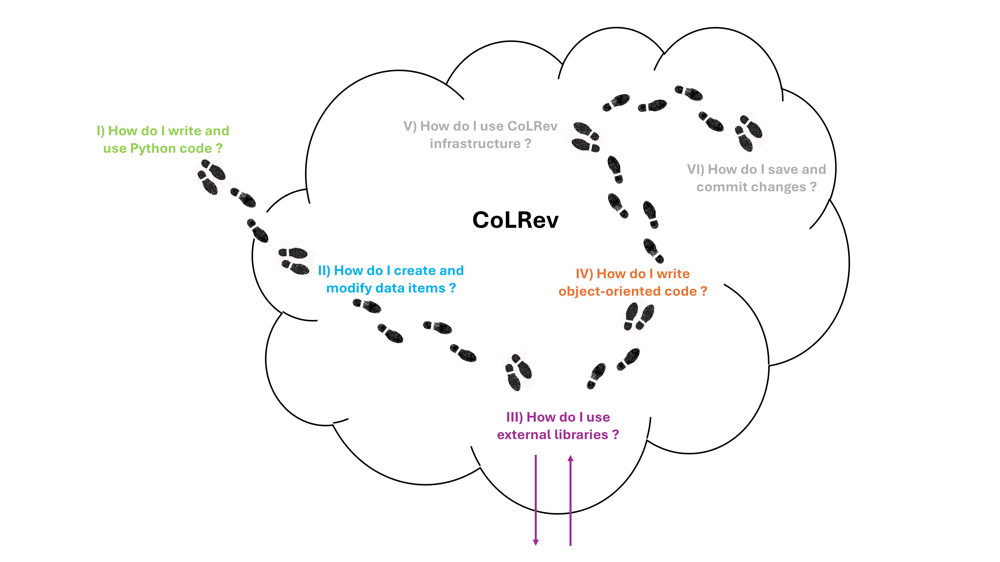

<!-- _class: lead -->

<!-- _class: centered -->

# Project: Introduction to Python (2)

---

# Start our development environment on GitHub Codespaces

[](https://github.com/codespaces/new?repo=digital-work-lab/practice-python)



---

# Package setup

To create a new Python package, you can use package and dependency management tools, such as [Poetry](https://python-poetry.org/) and `poetry init`.

If you work on existing CoLRev packages, you can extend the existing code available in the [internal packages directory](https://github.com/CoLRev-Environment/colrev/tree/main/colrev/packages).

To create a new CoLRev package, navigate to the [internal packages directory](https://github.com/CoLRev-Environment/colrev/tree/main/colrev/packages) and run

```
colrev package --init
```

This command assists you in setting up a new CoLRev package interactively.

More information on package development is available in the [documentation](https://colrev-environment.github.io/colrev/dev_docs/packages.html).

---

# Resources

Introductory:

- [Python challenges](https://pythonprinciples.com/challenges/)
- [Python CheatSheet](https://medium.com/@roelljr/ultimate-python-cheat-sheet-practical-python-for-everyday-tasks-c267c1394ee8)
- [11 tips for Python beginners](https://realpython.com/python-beginner-tips/)
- [PEP 8 — the Style Guide for Python Code ](https://pep8.org/)

More advanced:

- [The Hitchhiker's Guide to Python](https://docs.python-guide.org/)
- [RealPython Tutorials](https://realpython.com/)
- [Python design patterns](https://refactoring.guru/design-patterns/python)

Tip:
You can use this [tutorial](https://www.codecademy.com/catalog/language/python?g_network=g&g_productchannel=&g_adid=624888211335&g_locinterest=&g_keyword=codecademy%27s%20learn%20python&g_acctid=243-039-7011&g_adtype=&g_keywordid=kwd-2259230975260&g_ifcreative=&g_campaign=account&g_locphysical=9042755&g_adgroupid=128133971748&g_productid=&g_source={sourceid}&g_merchantid=&g_placement=&g_partition=&g_campaignid=12575778360&g_ifproduct=&utm_id=t_kwd-2259230975260:ag_128133971748:cp_12575778360:n_g:d_c&utm_source=google&utm_medium=paid-search&utm_term=codecademy%27s%20learn%20python&utm_campaign=INTL_Brand_Phrase&utm_content=624888211335&g_adtype=search&g_acctid=243-039-7011&gad_source=1&gclid=CjwKCAjwzIK1BhAuEiwAHQmU3t-FhdTeqJcFCUfaU1x1cvYdKGfh9vdxz1b8ll5Tl_2wcSc8wgMNhRoCJqoQAvD_BwE) for more insights in Python

---

# Next: Best practice and hacking sessions (per group)

- Read the CoLRev-Enhancement Proposal on SearchSources [CEP-002](https://colrev-environment.github.io/colrev/foundations/cep/cep003_search_sources.html), and raise questions in the issue feed (if any)
- Take notes on key challenges and questions (for the best practice session)
- Attend consultation sessions: schedule a session via [Calendly](https://calendly.com/gerit-wagner/30min?month=2023-10)

---

# We value your feedback and suggestions

We encourage you to share your feedback and suggestions on this slide deck:

<a href="https://github.com/digital-work-lab/open-source-project/edit/main/slides/04-python_2w.md" target="_blank">
   Suggest specific changes by directly modifying the content
</a>
<br>
<a href="https://github.com/digital-work-lab/open-source-project/issues/new" target="_blank">
   Provide feedback by submitting an issue
</a>
<br>

Your feedback plays a crucial role in helping us align with our core goals of **impact in research, teaching, and practice**. By contributing your suggestions, you help us further our commitment to **rigor**, **openness** and **participation**. Together, we can continuously enhance our work by contributing to **continuous learning** and collaboration across our community.

Visit this <a href="https://digital-work-lab.github.io/handbook/docs/10-lab/10_processes/10.01.goals.html" target="_blank">page</a> to learn more about our goals:  🚀 🛠️ ♻️ 🙏 🧑‍🎓️ . 
