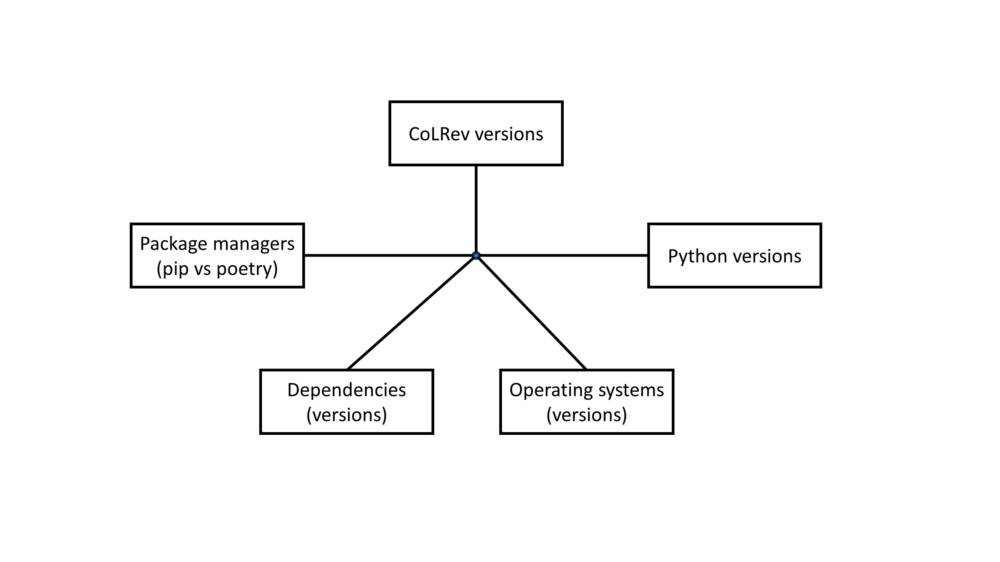

<!-- _class: centered -->

# WI-Project: Open-Source Development

## Best Practice Session

---
<!-- paginate: true -->

# Learning objectives

Our objectives for today are to

- Discuss current challenges and how they can be addressed
- Facilitate the practical application of Git commands and Python coding from previous sessions

The focus is on **helping teams organize their work effectively**. To this end, we

- Encourage you to share challenges, errors or lessons learned
- Do not introduce new commands, except when you ask for them or when they are useful for your work

---

# Questions and work status

- Warm-up questions
- Why are there errors in my environment?
- How does CoLRev work?
- How can we organize and split tasks?
- How should we select merging strategies?
- Open issues

---

# Quick warm-up questions

**Do we have to change the README.md?**
- You do not have to change the top-level README.md file, but you have to update README.md files in subdirectories to document your work.

**How can I commit if the pre-commit hooks fail?**
- The pre-commit hooks can be skipped using `git commit -n -m "commit message..."`. The `-n` flag stands for `--no-verify` and skips the pre-commit hooks.
- However, pre-commit hooks should pass to ensure good code quality. Some of the failing tests have been fixed recently.

**How can I get access rights to create branches in the fork?**
- Ask the team lead to invite you to the fork (see [step 2](https://digital-work-lab.github.io/open-source-project/output/02-git.html#32)).

---

# Work status: Environment setup

- Errors may be raised only in specific settings, i.e., versions of operating systems, Python, package managers, dependencies, and CoLRev
- What we do to identify and fix errors: 

    - Run [matrix tests](https://github.com/CoLRev-Environment/colrev/actions/workflows/tests.yml) covering 16 different environments
    - Reduce dependencies
    - Fix errors that are reported

- What you can do to avoid errors:

    - Use supported environments, such as GitHub Codespaces or Ubuntu
    - Avoid cutting-edge versions (of operating systems and Python)
    - Report errors



---

# Work status: Environment setup

Are you confident with your setup, including the fork, local development, running your code, executing pre-commit hooks to improve code quality?

Summarize the work status per group:

- What are the challenges we can discuss?
- What was particularly helpful? Are there any insights you can share with the other teams?

---

# Work status: Where to contribute

- Understanding of CoLRev

    - **User workflow**: Start with the [video](https://colrev-environment.github.io/colrev/) and check ``gitk`` after each step
    - **Architecture**: Starting point: [API chart and reference](https://colrev-environment.github.io/colrev/dev_docs/api.html) and [modules](https://github.com/CoLRev-Environment/colrev/tree/main/colrev)
    - **Package development and SearchSources**: Starting point: [package development resources](https://colrev-environment.github.io/colrev/dev_docs/packages.html), [CEP 003 - SearchSources](https://colrev-environment.github.io/colrev/foundations/cep/cep003_search_sources.html)

- As a team, do you know where and how to contribute your code, i.e., the modules, classes to use or create?

---

# Work status: How to organize tasks

- How did you distribute tasks in the team?
- Who works on what, which branches did you create, does regular sync work for you?

---

# Best practices

- Follow the [branching strategy](https://digital-work-lab.github.io/open-source-project/output/02-git.html#25)
- [Search](https://github.com/search), [read](https://www.turing.com/kb/start-reading-code-the-right-way) and understand your code and the code in related projects
- Check and fix code quality regularly (at least: before creating a commit):

```
pre-commit run --all
```

- Carefully select changes (`git add -p`) and review changes before creating a commit
- Commit often
- Synchronize regularly in your fork and with `remotes/upstream`

---

<!-- _class: centered -->

# Open questions?

---

# We value your feedback and suggestions

We encourage you to share your feedback and suggestions on this slide deck:

<a href="https://github.com/digital-work-lab/open-source-project/edit/main/slides/05-best_practice.md" target="_blank">
   Suggest specific changes by directly modifying the content
</a>
<br>
<a href="https://github.com/digital-work-lab/open-source-project/issues/new" target="_blank">
   Provide feedback by submitting an issue
</a>
<br>

Your feedback plays a crucial role in helping us align with our core goals of **impact in research, teaching, and practice**. By contributing your suggestions, you help us further our commitment to **rigor**, **openness** and **participation**. Together, we can continuously enhance our work by contributing to **continuous learning** and collaboration across our community.

Visit this <a href="https://digital-work-lab.github.io/handbook/docs/10-lab/10_processes/10.01.goals.html" target="_blank">page</a> to learn more about our goals:  🚀 🛠️ ♻️ 🙏 🧑‍🎓️ . 
