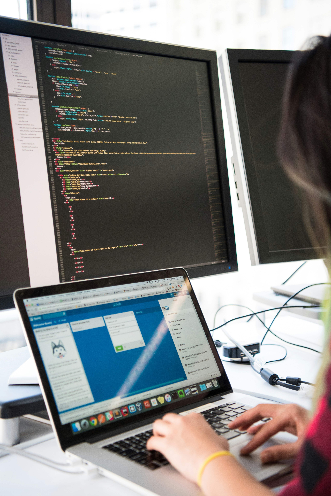

<!-- paginate: true -->

<!-- _class: centered -->

# WI-Project: Open-Source Project

## The Review Session

Prof. Dr. Gerit Wagner
Fakultät Wirtschaftsinformatik und Angewandte Informatik
Otto-Friedrich-Universität Bamberg

---
<!-- paginate: true -->

# The Review Session

In this session, you will **adopt the perspective of a maintainer**, i.e., a gatekeeper who takes responsibility for an open-source project by screening, improving, and integrating code contributions.

As a group, your goals are:

1. Download the code from the pull request (fork) to your local machine or Codespace
2. Test whether the code works as expected
3. Debug and improve the code (if necessary)
4. Document your assessment in the pull request on GitHub and suggest merging, revising, or rejecting the contribution

---

# The Process

1. Group is assigned to a pull requests
2. Review session:
    - Stage 1 (10 min)
    - Opportunity to ask questions
    - Stage 2 (10 min)
    - Opportunity to ask questions
    - Stage 3 (10 min)
3. Short summary of the code review (2-5 min)

---

<!-- _class: centered -->

# Short break

---

# Feedback

Our feedback for you

- On the code contribution
- On the project

Your feedback for us

- Let us know how we can improve
- We have a [GitHub issue](https://github.com/digital-work-lab/open-source-project/issues) to document and track improvements
- You should have received the evaluation survey

---

# Summary (I)

- You will be added as a contributor on GitHub (to opt out, e-mail me)
- Consider mentioning the contribution in your CV:

**Open-Source Contributions**
CoLRev - An open-source environment for Collaborative Literature Reviews

- Role: Contributor/Developer
- Date: 2024
- Description: Contributed to the development of CoLRev, an open-source environment designed to facilitate collaborative literature reviews. Implemented the package extension *unpaywall* (insert your project).
- Repository: [CoLRev on GitHub](https://github.com/CoLRev-Environment/colrev)
- DOI: 10.5281/zenodo.11668338

<!-- 

# How this project may benefit you

- The value of Open Source Software (OSS) development experiences is increasingly recognized as a significant indicator of a candidate's capabilities in technology and software development.
- According to Long (2009, *Journal of Information Technology Education: Research*), OSS contributions are noteworthy on resumes and play a crucial role in hiring and promotion decisions.
- Employers view OSS experiences as strong evidence of a candidate's:
  - Practical skills
  - Problem-solving abilities
  - Collaborative spirit
- You can add this project to your CV!
-->

---

# Summary (II)

**Thank you for your contribution!**
Remember - your work helps researchers. Many have already commended CoLRev, including Guy Paré, Piers Steel, and Blair Wang 🎉 🙌 🎊

- Grades will be entered in FlexNow.
- We supervise theses in the context of CoLRev (see [topics](https://digital-work-lab.github.io/theses/docs/topics.html) with programming label) - reach out if you are interested!
- If you enjoyed the project, please help us spread the word and recommend our project!

---

# We value your feedback and suggestions

We encourage you to share your feedback and suggestions on this slide deck:

<a href="https://github.com/digital-work-lab/open-source-project/edit/main/slides/06-code_review.md" target="_blank">
   Suggest specific changes by directly modifying the content
</a>
 
<a href="https://github.com/digital-work-lab/open-source-project/issues/new" target="_blank">
   Provide feedback by submitting an issue
</a>
 

Your feedback plays a crucial role in helping us align with our core goals of **impact in research, teaching, and practice**. By contributing your suggestions, you help us further our commitment to **rigor**, **openness** and **participation**. Together, we can continuously enhance our work by contributing to **continuous learning** and collaboration across our community.

Visit this <a href="https://digital-work-lab.github.io/handbook/docs/10-lab/10_processes/10.01.goals.html" target="_blank">page</a> to learn more about our goals:  🚀 🛠️ ♻️ 🙏 🧑‍🎓️ . 
